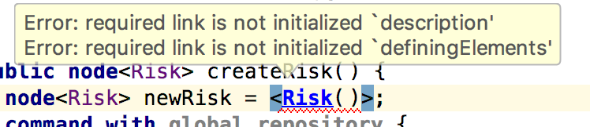
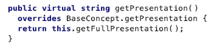
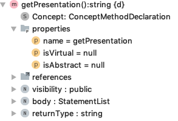
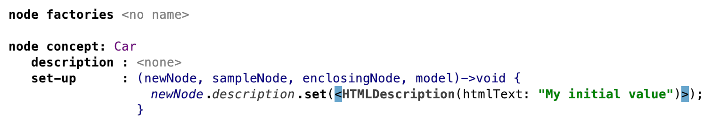
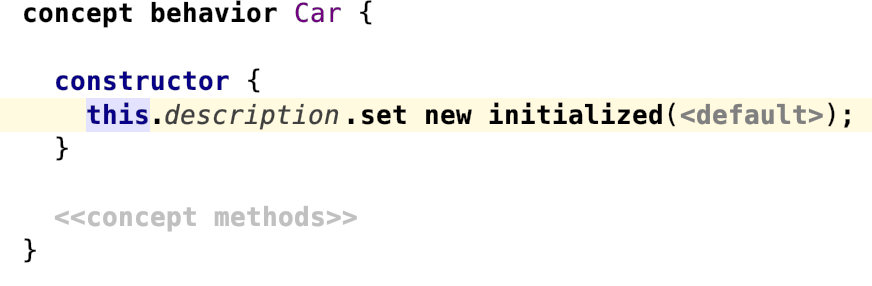
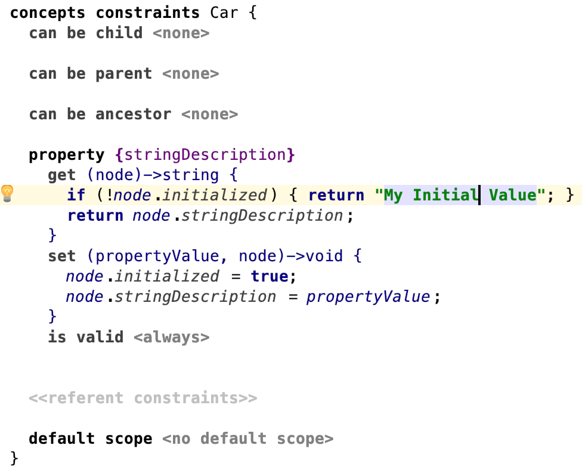

# [Behavior Aspect](https://www.jetbrains.com/help/mps/behavior.html)

The behavior aspect can be used for defining methods for the concepts of the language.


!!! question "Can you use asynchronous code in behavior methods such as calling external tools?"

    Be careful when doing so. Make sure to not mix concurrent locking aspects such as write and read actions with behavior code. 
    It should always be assumed that you have the correct lock in these methods. Move the code concerning the concurrent access for example into a background task.
    More information can be found in [Progress indicators | MPS](https://www.jetbrains.com/help/mps/progress-indicators.html).

!!! question "Where can you save temporary information about nodes?"

    Consider saving temporary data about nodes in annotations and user objects ([node/.putUserObject](http://127.0.0.1:63320/node?ref=8865b7a8-5271-43d3-884c-6fd1d9cfdd34%2Fjava%3Aorg.jetbrains.mps.openapi.model%28MPS.OpenAPI%2F%29%2F%7ESNode.putUserObject%2528java.lang.Object%2Cjava.lang.Object%2529), [node/.getUserObject](http://127.0.0.1:63320/node?ref=8865b7a8-5271-43d3-884c-6fd1d9cfdd34%2Fjava%3Aorg.jetbrains.mps.openapi.model%28MPS.OpenAPI%2F%29%2F%7ESNode.getUserObject%2528java.lang.Object%2529))
    instead of introducing properties. 
    You can store and access Java objects in `SNode::putUserObject()` as key-value pairs) where you usually could not access them in the MPS context, e.g. keeping them as node members and access them in an editor, a checking rule or anything else. This approach is hard to trace and maintain and should only be used in exceptional cases.
    For the generator, consult the section *Transferring User Data* of the [generator documentation](https://www.jetbrains.com/help/mps/generator-language.html#generatorlanguagereference).

??? question "How to mark a constructor-created child optional? (created by a light quotation)"

    > Example:

    > {width="600px"}

    Solutions:

    - Initialize it with `null` in the light quotation.
    - Create it without a light quotation.
    - Allow the child to be optional (`[0..1]`).

!!! question "How can you delete a child node from a node where the child’s concept no longer exists and the parent node's child link is no longer defined?"

    ```java
    node.getChildren().where(…).foreach {it=> 
        it.delete
    }
    ```

??? question "Why does the virtual method have *isVirtual=false*?"

    > Given there is a virtual behavior method `getPresentation`.
    > When I override `getPresentation` in a subconcept, it displays the overriding method to be virtual.
    
    > 
    
    > Yet, I see that `methodDeclNode.isVirtual` is *null*.
    
    > 
    
    > Why is that?

    Note that `isVirtual` and `isVirtual()` on a method have different semantics.

    ```java
    public boolean isVirtual() { 
        return this.isVirtual || this.overridenMethod != null; 
    }
    ```
    
    The editor shows that a method is _virtual_ when `isVirtual()` is true. As a result, overriding methods of virtual methods are not necessarily having `isVirtual=true`, but will still display _virtual_.
    
    The rationale behind this may be that if one method overrides another one, both must be virtual. This information is needed so that the runtime will find out which of the two implementations to call. So we may read the `isVirtual` more precisely as "is explicitly virtual", and `isVirtual()` as "is effectively virtual".

    {{ contribution_by('abstraktor') }}

## Initialization

The constructor in the behavior aspect is a bit confusing to beginners because the node is not yet attached to its parent.
In the case of root nodes, it might not even have a parent.

Internally, there is also the idea of node owners that the JavaDoc of
[SNodeOwner](http://127.0.0.1:63320/node?ref=6ed54515-acc8-4d1e-a16c-9fd6cfe951ea%2Fjava%3Ajetbrains.mps.smodel%28MPS.Core%2F%29%2F%7ESNodeOwner) and its
implementing classes describe. When you create a new node, the owner is an [FreeFloatNodeOwner](http://127.0.0.1:63320/node?ref=6ed54515-acc8-4d1e-a16c-9fd6cfe951ea%2Fjava%3Ajetbrains.mps.smodel%28MPS.Core%2F%29%2F%7EFreeFloatNodeOwner), This is the state any node has at creation time when a node wasn't added to any model yet. When the node is part of a model, it has an [AttachedNodeOwner](http://127.0.0.1:63320/node?ref=6ed54515-acc8-4d1e-a16c-9fd6cfe951ea%2Fjava%3Ajetbrains.mps.smodel%28MPS.Core%2F%29%2F%7EAttachedNodeOwner). After calling `myNode.detach` it has an [DetachedNodeOwner](http://127.0.0.1:63320/node?ref=6ed54515-acc8-4d1e-a16c-9fd6cfe951ea%2Fjava%3Ajetbrains.mps.smodel%28MPS.Core%2F%29%2F%7EDetachedNodeOwner).
The node could go be added back to a model.

??? question "How do you initialize a node? :beginner:"

    ```kroki-plantuml
@from_file:aspects/diagrams/initialize_node_car_example.puml
    ```

    > How can I ensure that all created nodes will have a non-null `HTMLDescription`?

    **Using a node factory**

    The node factory will be called when

    - The code completion menu is invoked to create such a node or to replace another one.
    - `add new initialized`, `set new initialized`, or `replace new initialized` is called.
    - Such a node is created as a root from the context menu in the project view.

    The node factory is **not** called when

    - You use quotations to create the node e.g. `<Car()>`.
    - Viewing the node in the editor.
    - Adding it as a root with `model.add root(<Car()>)`.
    - Adding it as a root with `model.add new root(Car)`.

    {width="600px"}

    **Using a behavior constructor**

    Using a behavior constructor will only partially achieve this. Note that it will only be called when

    - creating nodes with `add new initialized()`, `set new initialized()` and similar methods from `j.m.lang.actions` and `j.m.lang.smodel`.
    - creating a node with `new node<Car>()`.

    Using a quotation will **not** call this constructor.

    {width="600px"}

    **Using a property getter**

    You could use an `initialized` variable and a combination of property getters and setters.

    This solution would work only for properties, not children or references, and requires quotations to set the initialized value if trying to override the default. Furthermore, your quotations will still be marked. 

    {width="500px"}

    <figure markdown>
    {width="500px"}
      <figcaption>Usage</figcaption>
    </figure>
    

!!! question "Can you access the parent in the constructor? :beginner:"

    No, it doesn't work because the node is not attached yet ([Concept constructors | MPS](https://www.jetbrains.com/help/mps/behavior.html#conceptconstructors)). Use a [node factory](https://www.jetbrains.com/help/mps/smodel-language-modification-operations.html#newnodecreation) to access the parent instead.

!!! question "How can you query the context in a node constructor?"

    > Does anyone know a way to find the contextExpression from the node constructor?

    Use node factories instead of constructors and make use of the `enclosingNode` parameter. 
    Constructors are invoked always when creating a node. Node factories are executed only by the editor and by the `new initialized ...` expression.
    
    Note: Node factories are invoked in the inverse order of constructors. MPS will first execute the specific node factory and the more generic ones if they exist.

!!! question "Is there a way to call the constructor of a super-concept inside the constructor of a sub-concept?"
    > Something like:
    > ```java
    constructor {
    superConcept()
    }
    ```

    `#!java concept/MyConcept/.new initialized instance()` provides this behavior.


## Bugs/Missing Features

Behavior methods can only partially be compared to ordinary Java methods. They don't support as many feature because the
behavior aspect uses a custom generation plan that doesn't included all Base Language extentions and are internally differently
implemented.

!!! question "How can you use generic return types where the returned expressions is cast to concept<T> which is a parameter of the function?"

    This is not possible (MPS-22502). The as cast expects a reference to a concept, the type variable can't be used in this place. There are ways to circumvent this by using lower level code but it won't help. I think you also can't really use the information from the type variable because this information is not available at runtime because of [Java type erasure](https://www.baeldung.com/java-type-erasure).

!!! question "Can you use a more specific return type while overriding a behavior method?"

    No, it is not possible (MPS-27720).

!!! question "Can you use variable arguments (varArgs) in behavior methods?"

    No, it is not possible (MPS-31056).

!!! question "Can you enter a *throws* clause in behavior methods?"

    No, it is not possible (MPS-22306).