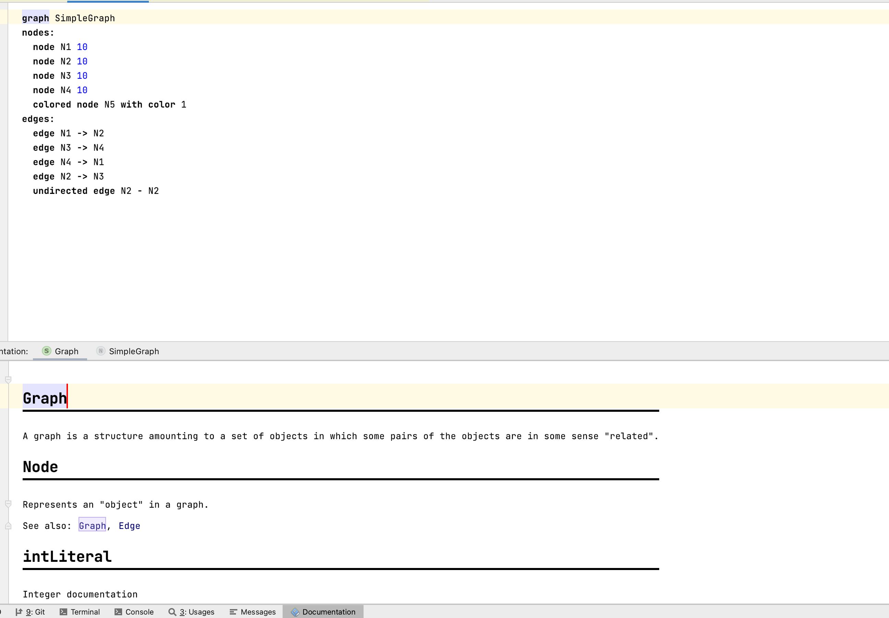

# Documentation Aspect

The language ^^com.mbeddr.doc^^ in {{ mbeddr() }} contributes to this aspect. An old documentation of the documentation languages
can be found [here](http://mbeddr.com/files/documentationdocumentation.pdf). It allows defining a documentation node that you export to XHTML, Latex, and MarkDown. You can implement new targets quickly. When you invoke the intention *Add Reference to
Documented Concept* while defining a new section as part of a chapter, the *Documentation* tool at the bottom of the screen shows the documentation for this concept.

This tool is just one possible way of viewing the documentation that you write with *com.mbeddr.doc*. You can, for example, also export it as an HTML document that you can publish online or offline, or write a new exporter to support the format that you need.

There are also different types of documentation that might require different (non-MPS) tools. On the one hand, onboarding and domain-specific guides might work better outside MPS, for example as a webpage or generated Word document. Domain-specific guides can also contain best practices, naming conventions, design patterns, and other topics. On the other hand, users can view documentation that describes the MPS languages and the RCP itself in the documentation tool.

You can also [add tips to your RCP](https://www.jetbrains.com/help/mps/contributing-to-mps-project.html#addingproductivityguidetips) (called tip of the day) or add a help URL in the inspector of concepts to better integrate documentation into the tool. Depending on your project,
you might also want to provide onboarding training in the form of videos, live trainings or workshops depending on the number
of users.

To learn more about writing documentation, read [10 Best Practices for Writing Documentation | grammarly.com](https://www.grammarly.com/blog/developer/10-best-practices-writing-documentation/)

!!! question "How do you export the documentation?"

    Click *Make Model* or *Rebuild Model* in the model's menu containing the documentation. A new folder *doc_gen* will get generated.

!!! question "Should you write documentation? Is this aspect necessary?"

    Yes, code is only sometimes self-documenting. You have the following possibilities for writing documentation: 

    - JavaDoc ([Use javadoc liberally](http://www.javapractices.com/topic/TopicAction.do?Id=60))
    - the intention [Document](http://127.0.0.1:63320/node?ref=r%3Ae5a8b5c7-85b5-4d59-9e4e-850a142e2560%28jetbrains.mps.lang.structure.intentions%29%2F7862711839424636005)
    - ^^com.mbeddr.documentation^^
    - ^^com.mbeddr.doc^^
    - the short description property of concepts
    - [DocumentedNodeAnnotation](http://127.0.0.1:63320/node?ref=r%3A00000000-0000-4000-0000-011c89590292%28jetbrains.mps.lang.structure.structure%29%2F7862711839422615209)

!!! question "How can you show the documentation of a concept in the documentation tool?"

    Take a look at the doc.aspect project in {{ mbeddr() }}. A node attribute can be attached to pieces of a document to bind the document to some concept or node. There is also an example project which demonstrates the usage.

    {{ answer_by('szabta89') }}

!!! question "Is there a way to resolve references to embedded images (screenshots) across different documents?"

    Add the document containing the reference to the *depends on* section of the current document.