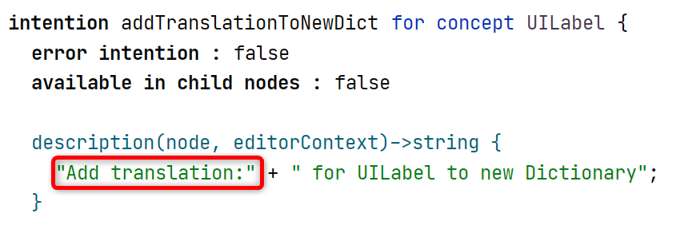
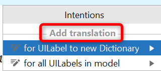

# [Intentions Aspect](https://www.jetbrains.com/help/mps/mps-intentions.html)

>  Intentions provide fast access to the most used operations with syntactical constructions of a language.
>
> — <cite>MPS documentation</cite>

!!! question "How can you go to the declaration of an intention when you open the intention menu?"
    
    Select the intention and click the arrow/press the right arrow key --> *Go to intention declaration*.

!!! question "How do you execute an action as an intention?"

    Add the action to the action group [ActionsAsIntentions](http://127.0.0.1:63320/node?ref=r%3A9832fb5f-2578-4b58-8014-a5de79da988e%28jetbrains.mps.ide.editor.actions%29%2F6893431717880497466).

??? question "How can you group intentions and give them names?"

    Use ^^com.mbeddr.mpsutil.intentions^^ from {{ mps_extensions() }}. 
    Alternatively, you can split the description into multiple literals. The first literal will then be used to group intentions.

    {width="600px"}

    {width="300px"}

!!! hint "I need to get all available intentions for a node."

    ```java
    IntentionsManager.getInstance().getAvailableIntentions();
    ```

!!! question "How can you make intentions visible?"
    
    [Making intentions visible](https://specificlanguages.com/posts/2021-02/10-making-intentions-visible/){{ blog('sl') }}

!!! question "How can you show a submenu in the intention menu?"
    
    [Showing a submenu in the intentions menu](https://specificlanguages.com/posts/2022-01/27-intention-submenu/){{ blog('sl') }}

!!! question "An Intention isn't visible, although it should be. What can you do?"

    > Intention X should be visible on Concept Y. However, when I select an instance of Y, it is not listed in the intention menu. What can I do?

    Make sure the language that declares the intention is in the *Used Languages* section of the model:

        - Check if the intention applies to the concept you want it to apply to. (Maybe *visible on child nodes* is not set).
        - Check if the *isApplicable* condition evaluated to true (try to avoid adding `System.err.our` prints to the model).

    {{ contribution_by('coolya') }}