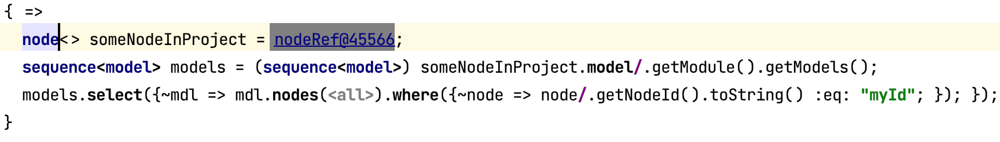

# [Structure Aspect](https://www.jetbrains.com/help/mps/structure.html)

The structure aspect contains all the concept and interface declarations of a language.

- [old cheatsheet](http://dsl-course.org/jetbrains-mps-structure-aspect/)
- [Finding examples of MPS features: Link instances](https://specificlanguages.com/posts/2022-05/06-finding-examples-link-instances/){{ blog('sl') }}

## [Concepts](https://www.jetbrains.com/help/mps/structure.html#conceptsandconceptinterfaces)

Concept declarations are the main root nodes that you add to this aspect. When you use nodes use concepts from your language, and the language has
generator configurations, the generator of this language will be invoked by default to transform the languages.

!!! question "How can you create an MPS concept declaration programmatically?"

    [Create an MPS concept declaration programmatically](https://specificlanguages.com/posts/create-mps-concept-declaration-programmatically/){{ blog('sl') }}

!!! warning "Concept XY wasn't found in the language :beginner:"

    [Concept not found](https://specificlanguages.com/posts/2022-03/14-concept-not-found/){{ blog('sl') }}

!!! question "How do you find examples of MPS concepts? :beginner:"

    [Finding examples of MPS concepts](https://specificlanguages.com/posts/2022-01/19-finding-examples/){{ blog('sl') }}

!!! question "When a concept extends another concept/implements some interfaces, which method is called when they are defined in more than one concepts/interfaces?"

    The used algorithm is a variant of [C3 linearization](https://www.wikiwand.com/en/C3_linearization) ([source](https://github.com/JetBrains/MPS/blob/bbbfb6d8596638d27fc298a784bae09dc78e4d1e/core/aspects/behavior/behavior-api/source/jetbrains/mps/core/aspects/behaviour/AbstractC3StarAncestorResolutionOrder.java#L30)). When the concept doesn't implement the method itself.  First, the implemented interfaces are recursively considered in declaration order, then the extended concept. You can try it yourself, for example, for the concept {{ mps_url("@mps.ClassConcept") }}:
    ```java
    BehaviorRegistryImpl r = (BehaviorRegistryImpl) ConceptRegistry.getInstance().getBehaviorRegistry();
    BHDescriptor d = r.getBHDescriptor(concept/ClassConcept/);
    #print r.getMRO().calcLinearization(_SAbstractConcept.wrap(concept/ClassConcept/));
    ```
    If you want to call a specific `#!java type()` implementation, you have just to cast the node to the corresponding concept and then call the method, for example, `#!java myNode as MyITypeable.type()`

!!! question "How can you get the short node ID from the node ID and vice versa?"

    - Short one: `#!java new IdEncoder().toText(node.getNodeId())`
    - Long one: `#!java new IdEncoder().parseNodeId(nodeId)`

!!! question "How can I assign node IDs manually?"

    Read [Assigning node IDs explicitly](https://specificlanguages.com/posts/2022-05/11-assigning-node-ids-explicitly/){{ blog('sl') }}.
    
    The same principal applies to model IDs. The regular model IDs that MPS generate are instances of RegularSModelId and are based on [UUIDs](https://www.baeldung.com/java-uuid) (using an optional suffix). They are globally unique. There is also an integer-based solution (IntegerSModelId) where the IDs are not globally unique. They are used, for example, for various descriptor models.

!!! question "Can I find a node by its ID?"

    You can write a script on the console to find it. For example:

    

    The *Navigate* main menu also contains an action *Go to node by ID*.

!!! question "Can I cast concept objects to super-concept objects?"

    > I have the following successful boolean check: `someConcept.isSubConceptOf(MySuperConcept)`
    > But if I put this code below, it fails with an exception that it cannot perform the cast: `((concept<MySuperConcept>) someConcept)`
    > The type of the expression someConcept is `concept<>.`

    There is a [cast](http://127.0.0.1:63320/node?ref=r%3A00000000-0000-4000-0000-011c89590301%28jetbrains.mps.lang.smodel.structure%29%2F1761385620274348152) for that. For example:
    ```java
    concept<> cls = node/AbstractMethodError/.concept;
    #print cls:BaseConcept.getLanguage().getQualifiedName();
    ```

!!! question "Can I get the ConceptEditorDeclaration for a given concept?"

    ```java
    concept<> concept = myNode/.getConcept(); 
    model editorModel = LanguageAspect.EDITOR.get((Language) concept.getLanguage().getSourceModule());
    #print editorModel.roots(ConceptEditorDeclaration).findFirst({~it => it.conceptDeclaration :eq: concept.asNode; });
    ```

## [Interfaces](https://www.jetbrains.com/help/mps/structure.html#conceptsandconceptinterfaces)

Interfaces work the same way as Java interfaces. They can be used to mark common classes, contain common methods and support the same aspects as
concepts. A special interface is [INamedConcept](http://127.0.0.1:63320/node?ref=r%3A00000000-0000-4000-0000-011c89590288%28jetbrains.mps.lang.core.structure%29%2F1169194658468)
that defines the name of nodes when a concept implements it.

!!! warning "The concept implements {{ mps_url("@mps.ISuppressErrors") }}, but the node still contains errors."

    You have to implement {{ mps_url("@mps.IDontApplyTypesystemRules") }} and {{ mps_url("@mps.ISkipConstraintsChecking") }}. [Suppressing Errors | MPS](https://www.jetbrains.com/help/mps/suppressing-errors.html) has some more information.

!!! question "What's {{ mps_url("@mps.IMainClass") }} used for?"

    It allows to execute Base Language code. [Shapes tutorial - Running the code](https://www.jetbrains.com/help/mps/shapes-an-introductory-mps-tutorial.html#runningthecode) contains an example.

## [Properties](https://www.jetbrains.com/help/mps/structure.html#properties)

You can use properties to save data in the model using primitive types, enumerations or regular expressions. *string* is
also considered a primitive type. Think twice before you use this type. Users can type anything as a value if you don't
at a constraint to this property.

String properties are also not referencable. For example, let's consider a property that defines
a root node's kind. When you use a child instead that can be referenced, you can reuse kinds or even provide a predefined list
of kinds with certain constraints. Even an enumeration can be a better choice in some cases unless you need the ability to enter any
value.

Changing this design decision later, means deprecating the string property and introducing a migration. If no standard
migration is possible, users might even have to change their models manually.

!!! question "How do you use a list of string properties? :beginner:"

    Wrap your property into a new concept and use a child collection:

    ```kroki-plantuml
@from_file:aspects/diagrams/list_string_properties.puml
    ```

!!! question "Can properties be overridden?"

    No, MPS-17143 contains more information.

!!! question "How to get the name of a concept property?"

    The easiest way to do this is via [PropertyIdRefExpression](http://127.0.0.1:63320/node?ref=r%3A00000000-0000-4000-0000-011c89590301%28jetbrains.mps.lang.smodel.structure%29%2F2644386474302386080). Then you can directly reference the property in question like this:
    `property/MyConcept : myProperty/.getName()`
    With this implementation, every property name change is calculated correctly.

    {{ contribution_by('abstraktor') }}

## [References](https://www.jetbrains.com/help/mps/structure.html#references)

To refer to other nodes in the model, use references. They have a scope and can be automatically created (smart references)
for nodes that have a name. References that are out of scopes still work, they are part of the model and are affected by
generation. As the name it implies, they only reference nodes which means that the referenced node or property won't change when
you edit the cell in the editor. There is also a distinction between optional and mandatory references, especially when trying to
delete them.

!!! question "How do you get the previous label of a reference?"

    ```java
    ((SReference)node.getReference(link)).getResolveInfo()` 
    // or
    node.reference<ref>.resolveInfo
    ```

!!! question "Can you use the resolve info to fix a broken reference?"

    ```java
    ResolverComponent.getInstance().resolve(...)
    ```

!!! question "How can you find broken references on the console?"

    ```java
    #instances<scope = global>(BaseConcept).where({~it => 
        it.references.any({~it => it.target == null; });
    })
    ```

!!! warning "Deleting references doesn't work when using the editor cell ref. presentation"

    Example: `[> thingref [> ( % thing % -> ref. presentation ) <] <]`

    Ref presentation automatically uses the name of the interface *INamedConcept*. If you add `auto-deletable: true` to the cell and the cardinality is `[1]`, MPS deletes the name but doesn't remove the reference. When the cardinality is [0..1], it deletes the reference. You expect this behavior because the reference is mandatory in the first case; in the second case, it is optional.