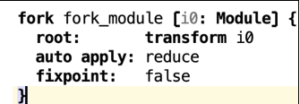

# Transformations Aspect

This language is part of [Shadow Models](https://jetbrains.github.io/MPS-extensions/extensions/shadowmodels) in {{ mps_extensions() }}. Consult the [documentation](https://jetbrains.github.io/MPS-extensions/extensions/shadowmodels/)
for more information.

!!! question "What's a fork?"

    

    It can group a list of applicable rules. If there are nodes in the output where one of the transformations would again be applicable, nothing will happen unless you enable the fixpoint mode.
    When you use the transform keyword, it will copy the input and all its descendants. If any input concept matches a transformation rule parameter in the auto-apply part, it will transform the input according to the matched transformation.

!!! question "What does the transform statement do?"

    It has the same meaning as a *COPY_SRC* macro in MPS and will copy the input node and apply a rule.