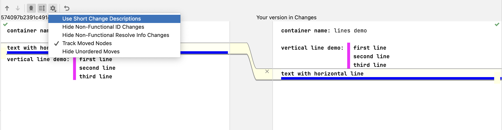
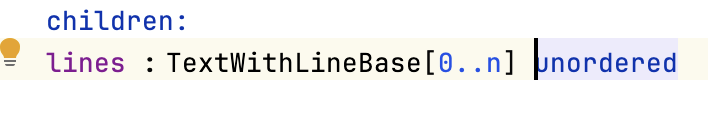
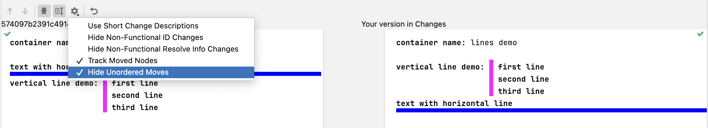

# [VCS Aspect](https://www.jetbrains.com/help/mps/mergehints.html)

> The VCS merge aspect language aspect defines strategies to automatically resolve merge conflicts for nodes, their children, references, and properties.
>
> — <cite>MPS documentation</cite>
[about](../about)
!!! warning "I pulled some changes or made some other VCS-related stuff, and strange errors appeared, or changes weren’t visible."

    There might be a bug related to caching or VCS in general. Invalidating the cache or restarting the project might help.
    There are quite some [bugs in VCS](https://youtrack.jetbrains.com/issues/MPS?q=%23%7BVersion%20Control%7D&u=1).

!!! question "How do you avoid merge conflicts?"
    
    [Avoiding merge conflicts](https://specificlanguages.com/posts/2022-02/01-avoiding-merge-conflicts/){{ blog('sl') }}

!!! question "What are some real-world use cases of merge hints?"

    - accepting our node when it contains a calculated hash or calculated result
    - accepting our node for nodes where the graphical representation changed (e.g., diagrams)
    - accepting our node when it contains additional information, such as node attributes

!!! question "How do I track/hide moved nodes in version control?"

    Activate the *Track Moved Nodes* option in the change dialog.  
    
    To `hide unordered moves` enable the feature in the same dialog. Children of such concepts must have the `unordered` flag set to true:
    
    
    Then the change won't be shown at all:
    
    