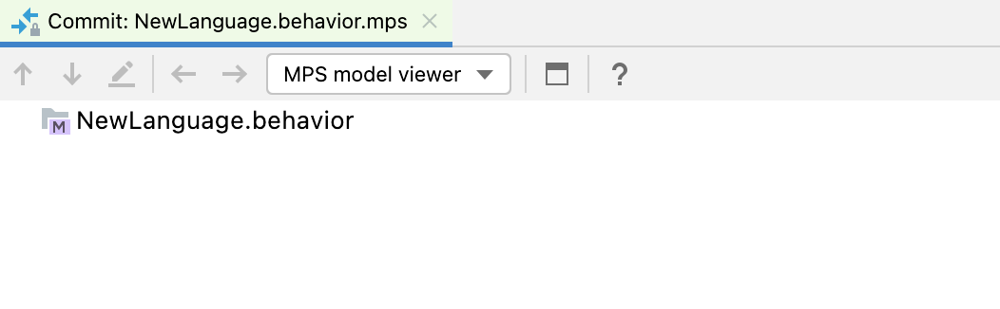
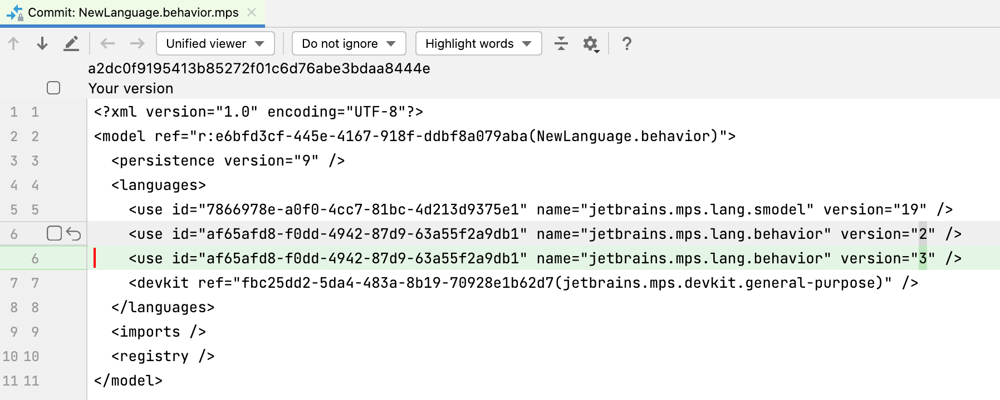
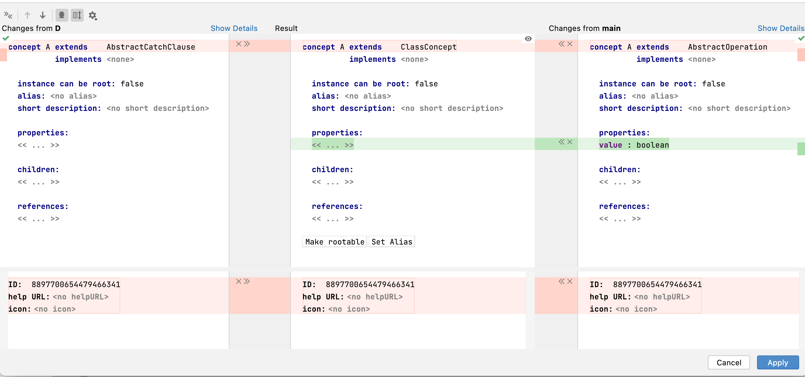
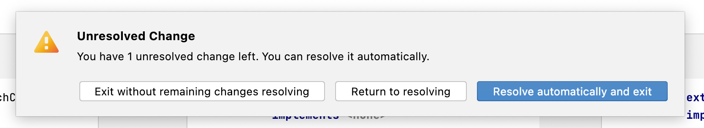
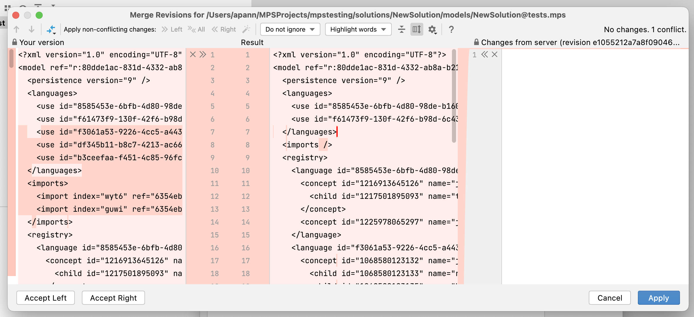
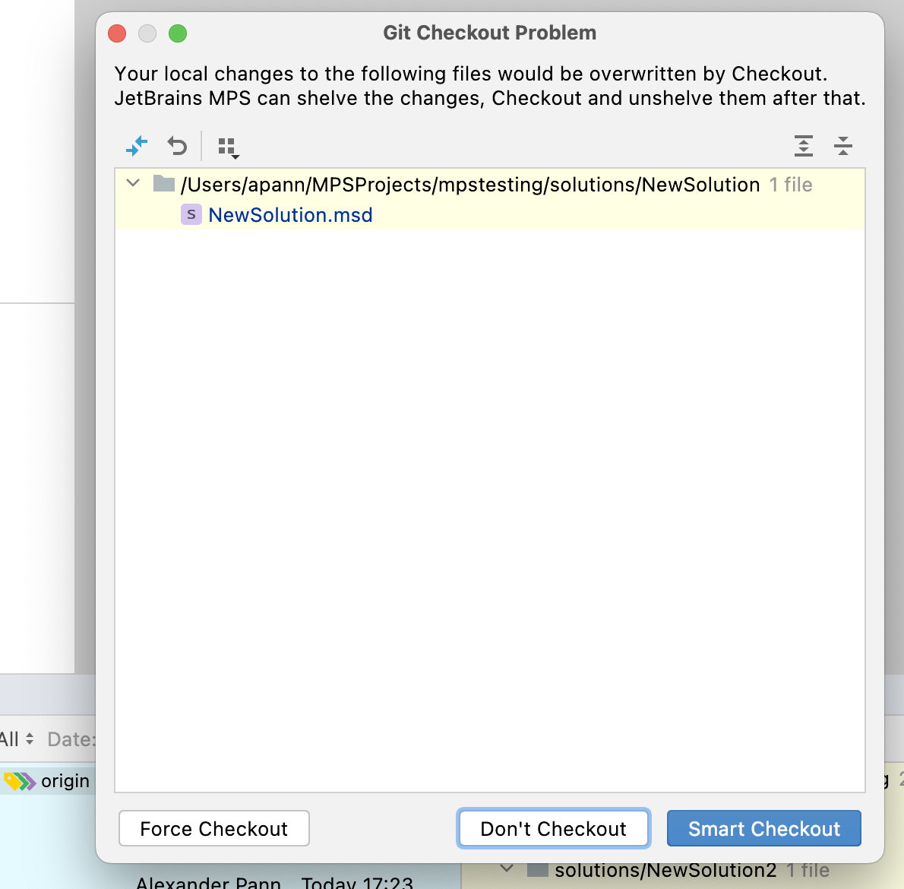
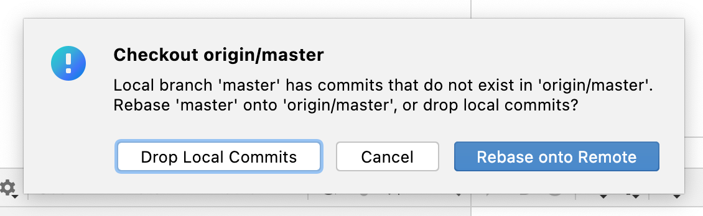
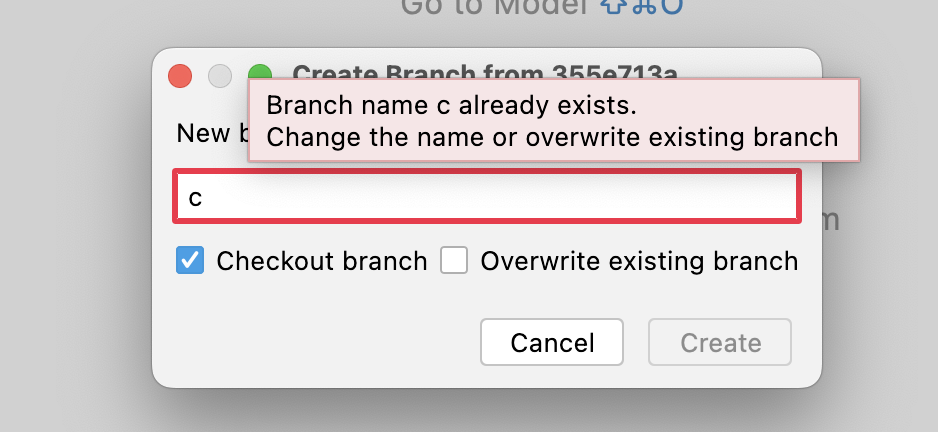
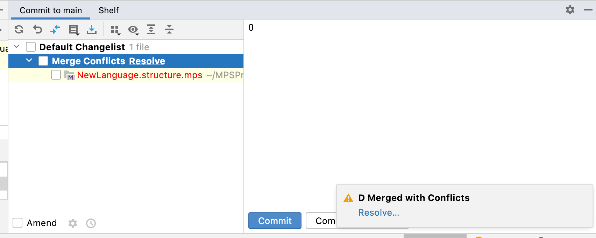
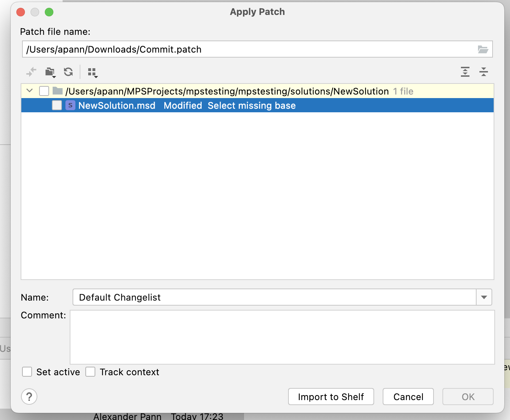

---
tags:
- infrastructure
---

# Git

Git is a free and open-source  distributed version control system that allows developers to manage their code and collaborate on projects.
While MPS supports the version control systems Git and Subversion, Git is the de-facto standard for MPS projects.
Read [Version control | MPS documentation](https://www.jetbrains.com/help/mps/version-control-integration.html) first to get a better understanding.

## Git problems

The following short sections describe common issues that you encounter with the Git integration in MPS. Except for the visual difference viewer, you are not forced to use the UI to work with Git in MPS. If you are comfortable using the command line, you can switch to the *Terminal* tool and use
ordinary Git commands.

### Invisible Git Change



Some changes in models can't be visualized by the MPS diff viewer. Switch to the *Unified viewer* or *Side-by-side viewer*
in the diff window to see the changes. Examples of invisible changes are version changes in language dependencies, [changes in the
node ID](https://www.jetbrains.com/help/mps/resolve-conflicts.html#290a8ea0), and [resolve info changes](https://www.jetbrains.com/help/mps/resolve-conflicts.html#7f7418c7).
[node ID](https://www.jetbrains.com/help/mps/resolve-conflicts.html#290a8ea0), and [resolve info changes](https://www.jetbrains.com/help/mps/resolve-conflicts.html#7f7418c7).



### Merge Conflicts



Use the button *>><<* at the top next to *Accept Yours* to accept all non-conflicting changes for the root nodes, and do the same for the changes in the root nodes below. Then use the *>>* or *<<* button to accept the change from the left or right side. You can reject changes with the *x* button. 
In other dialogs, there is a magic wand symbol to automatically apply non-conflicting changes.
Alternatively, you can use the *All* option to accept the changes.
You only have to resolve merge conflicts, all other changes can be resolved automatically. 



You can also edit the node in the center, but can't make changes like resolving references and
importing dependencies.

### Local Change in Node but the Node is Deleted on the Server



You can reject the deletion on the server by clicking *Select Left* or accept the deletion by clicking
*Accept Right*. **Don't** click the arrow in the right window to accept the change from the server. You will end up
with an empty file that can't be loaded.

### Checkout would overwrite local changes

{width="500px"}

When you hover with the mouse over the buttons, MPS explains what they do. *Force Checkout* switch to the new branch and discards any local changes; *Smart Checkout* [shelves the changes](https://www.jetbrains.com/help/mps/shelving-and-unshelving-changes.html), switches to the branch, and then unshelves the changes.
*Don't checkout* does nothing and closes the dialog.

### Checking Out a Remote Branch While Having Local Commits

{width="500px"}

The first two options are self-explanatory. *Rebase onto Remote* checks out the remote branch and appends the
local commits to the end.

### Local Branch Name Already Exists

{width="500px"}

If you don't need the old branch, use the overwrite option or find the branch in the lower right corner and click *Rename...*
or *Delete*.

### Failed Merge or Rebase



You can click *Resolve* in the Merge Conflicts change list or go to *Main menu* -> *Git* -> *Abort Merge/Rebase* to undo
the action.

### Applying a Patch, but the Base is Missing

{width="500px"}

After [creating a patch](https://www.jetbrains.com/help/mps/using-patches.html), you can't apply the patch because you've selected the wrong base path in the *Patch File Settings*.
The base path must be the path of the project displayed in the logical view.


!!! question "How do you compare Git branches?"

    Have a look at [this guide](/files/compare_git_branches.pdf).

!!! question "How should you configure Git?"
    
    Generated files should not be checked into Git (*classes_gen*, *source_gen*) unless the output of generators should be checked.
    
    Example from {{ mps_extensions() }}:

    - [.gitignore](https://github.com/JetBrains/MPS-extensions/blob/master/.gitignore)
    - [.gitattributes](https://github.com/JetBrains/MPS-extensions/blob/master/.gitattributes).

!!! question "Is there a hook in MPS that it will call when switching branches?"

    Register a [BranchChangeListener](http://127.0.0.1:63320/node?ref=498d89d2-c2e9-11e2-ad49-6cf049e62fe5%2Fjava%3Acom.intellij.openapi.vcs%28MPS.IDEA%2F%29%2F%7EBranchChangeListener) in an application or project plugin. Example: 
    ```java
    ProjectHelper.toIdeaProject(#project).getMessageBus().connect().subscribe(BranchChangeListener.VCS_BRANCH_CHANGED, new MyListener()).
    ```

!!! question "How can you find the Git commit that deleted a concept?"

    Assuming the concept is named `Foo`, search with Git Log in the corresponding structure model: `git log -SFoo -- path/to/structure.mps`

!!! question "How can I go to the first commit in a project on GitHub?"

    Use the book on the following page: http://farhadg.github.io/init/landing/

!!! question "During conflict resolution, what does *Resolve automatically and Exit* do exactly?"

    This button merges non-conflicting changes in roots and the metadata.
    
    A) A change in roots is not conflicting if:

    - there are [merge hints](https://www.jetbrains.com/help/mps/mergehints.html)
    - the node ID [changed](https://www.jetbrains.com/help/mps/resolving-conflicts.html#cd808d10)
    - the resolve info [changed](https://www.jetbrains.com/help/mps/resolving-conflicts.html#e052970a)

    B) Metadata changes are:

    - a dependency was deleted/added
    - do not generate flag was set
    - an engaged language on generated was added/removed
    - an imported model was added/deleted
    - a model attribute was changed (e.g., model user objects)
    - a module dependency was added/deleted
    - a used language was added/deleted/changed

      Those are two different merge sessions. TODO: How does the automatic resolving work with the metadata changes? (Are A and B applied to the metamodels?)

!!! question "When I shut down MPS, change files on disk (e.g., git pull), and restart MPS, it asks me if I want to reload the files from disks or use the cached models. Why?"

    Excerpt from MPS documentation:
    > MPS automatically saves changes that you make in your files. Various events trigger saving, such as compiling, running, debugging, performing version control operations, closing a file or a project, or quitting the IDE. Saving files can also be triggered by third-party plugins.
    
    An external change could be done by accident, for example, the project is on a shared drive, and someone else changes some files but not on purpose. You might also edit some MPS files with a different editor to fix some issues, so there must be the option to decide which version to use. The feature itself comes from the IntelliJ platform and is not MPS-specific:
    
    > If an external process changes a file that was opened and unsaved in IntelliJ IDEA, it results in two conflicting versions.

!!! question "How can I undo a merge or pull?"

    You can use 'git reset --hard ORIG_HEAD' to go back. To keep the local changes, use  `git reset --merge`.


## General

- [Git cheat sheet](https://github.com/arslanbilal/git-cheat-sheet)
- [git-tips](https://github.com/git-tips/tips)
- [Flight rules for Git](https://github.com/k88hudson/git-flight-rules) (troubleshooting)
- [On undoing, fixing, or removing commits in Git](https://sethrobertson.github.io/GitFixUm/fixup.html)
- [git-extras](https://github.com/tj/git-extras) (extra git commands)
- [Commit Often, Perfect Later, Publish Once: Git Best Practices](https://sethrobertson.github.io/GitBestPractices/)

## GitHub Publishing Checklist

Here is a list of links to help you get started with publishing projects to GitHub, especially in the context of
open source projects.

- Ready to use templates
    - [Template #1](https://github.com/cfpb/open-source-project-template)
    - [Template #2](https://github.com/giantswarm/example-opensource-repo)
- Necessary files/text
    - [README.md](https://docs.github.com/en/repositories/managing-your-repositorys-settings-and-features/customizing-your-repository/about-readmes)
    - [LICENSE](https://docs.github.com/en/repositories/managing-your-repositorys-settings-and-features/customizing-your-repository/licensing-a-repository)
    - description in the About section of the GitHub repository
- More extensive checklists
    - [Open Source Checklist](https://github.com/cfpb/open-source-project-template/blob/main/opensource-checklist.md)
    - [Am I ready to Open Source This?](https://gist.github.com/PurpleBooth/6f1ba788bf70fb501439)