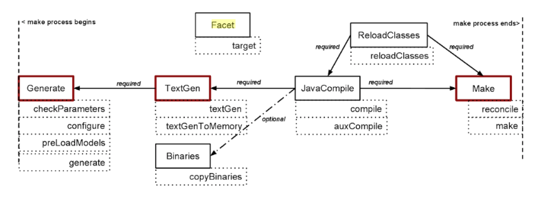

!!! question "Should I use this aspect?"

    No. You should use [plugin solutions](https://www.jetbrains.com/help/mps/plugin.html) instead.

!!! warning "References to keys in action context parameters are out of search scope."

    You need to add a dependency to [MPSCommonDataKeys](http://127.0.0.1:63320/node?ref=742f6602-5a2f-4313-aa6e-ae1cd4ffdc61%2Fjava%3Ajetbrains.mps.ide.actions%28MPS.Platform%2F%29%2F%7EMPSCommonDataKeys).
    This class extends [PlatformDataKeys](http://127.0.0.1:63320/node?ref=498d89d2-c2e9-11e2-ad49-6cf049e62fe5%2Fjava%3Acom.intellij.openapi.actionSystem%28MPS.IDEA%2F%29%2F%7EPlatformDataKeys)
    and this class extends [CommonDataKeys](CommonDataKeys).

!!! warning "My action is not visible."

    You have to add it to an ActionGroup that can be attached at differenct places such as the context menu or the build menu. 
    All of the action context parameters that are marked as required have to be available and the isApplicable block must
    return true for an action to be visible. For debugging purposes you can set "always visible" to true to check if your
    action is registered at all. You also need to have a standalone descriptor in your model for it to work. Additionaly,
    the solution kind should be set to Other in the Java tab of the solution properties ([official documentation](https://www.jetbrains.com/help/mps/plugin.html#actionsandactiongroups)).

!!! hint "I want to merge models."

    Use the language `de.itemis.mps.modelmerger` (experimental) from [mps-extensions](https://jetbrains.github.io/MPS-extensions/).

!!! hint "I want to check the structure of a node."

    Use the language `de.slisson.mps.structurecheck` from [mps-extensions](https://jetbrains.github.io/MPS-extensions/).

!!! hint "I want to store different states/versions of a node inside the model."

    Use the language `de.itemis.mps.nodeversioning` from [mps-extensions](https://jetbrains.github.io/MPS-extensions/).

!!! hint "I want to create new SContainmentLink for non-existent role[^1]."
    It can be created through [MetaAdapterFactory](http://127.0.0.1:63320/node?ref=6ed54515-acc8-4d1e-a16c-9fd6cfe951ea%2Fjava%3Ajetbrains.mps.smodel.adapter.structure%28MPS.Core%2F%29%2F%7EMetaAdapterFactory).

!!! question "How to I check if a model is a generator model, a test model etc.?"
    Call the corresponding method in [SModelStereotype](http://127.0.0.1:63320/node?ref=6ed54515-acc8-4d1e-a16c-9fd6cfe951ea%2Fjava%3Ajetbrains.mps.smodel%28MPS.Core%2F%29%2F%7ESModelStereotype).

!!! question "How do I add imports to a model?"

    Use the class [ModelImportHelper](http://127.0.0.1:63320/node?ref=742f6602-5a2f-4313-aa6e-ae1cd4ffdc61%2Fjava%3Ajetbrains.mps.project%28MPS.Platform%2F%29%2F%7EModelImportHelper) and call [addImport](http://127.0.0.1:63320/node?ref=742f6602-5a2f-4313-aa6e-ae1cd4ffdc61%2Fjava%3Ajetbrains.mps.project%28MPS.Platform%2F%29%2F%7EModelImportHelper.addImport%2528org.jetbrains.mps.openapi.model.SModel%2529).

!!! question "How do facets work?"

    

    Red rectangles: marker facets
    
    - do not define depdencies on other facets
    - known to MPS Make Process and are available for user
    - User can define where his/her own facet should fit in and decide if they require some facet.

    Usage:

    - Targets act as filters working on a stream of data delivered to them,
    - The data flowing along targets is called *resources*.
    - Resources are represented as Java tnterfaces and tuples,

[^1]:[How to create new SContainmentLink for non-existent role?](https://mps-support.jetbrains.com/hc/en-us/community/posts/360009473300-How-to-create-new-SContainmentLink-for-non-existent-role-) 