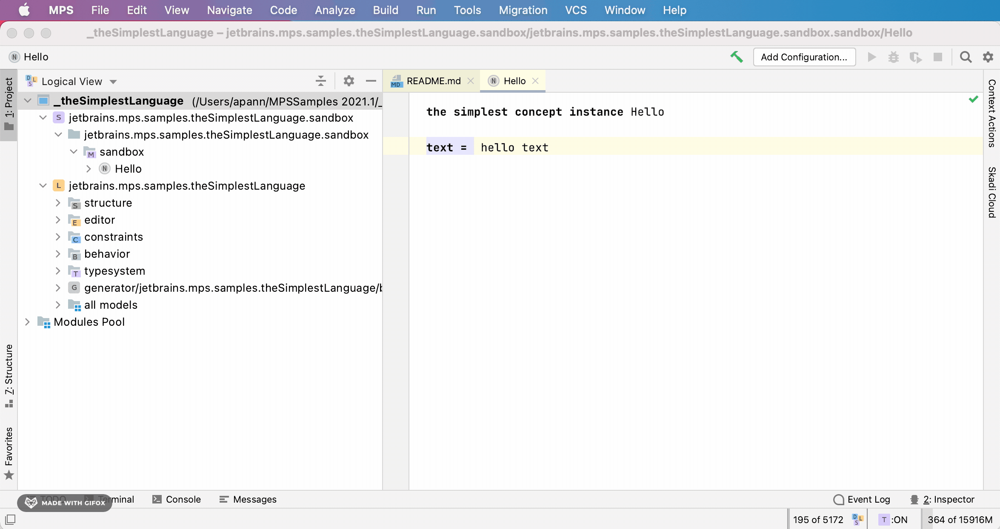
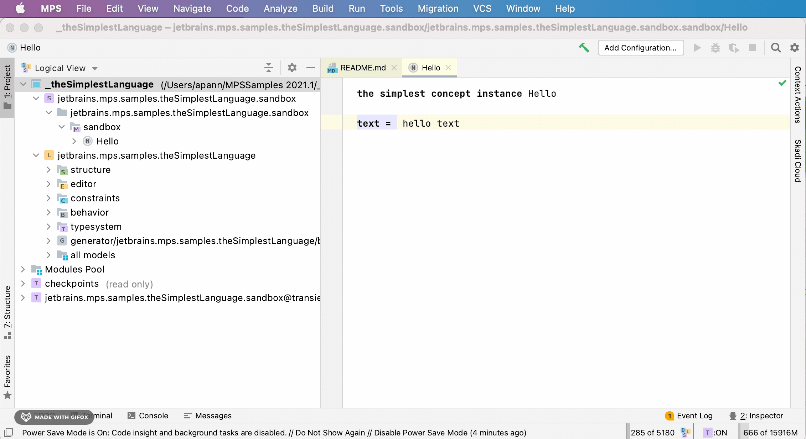
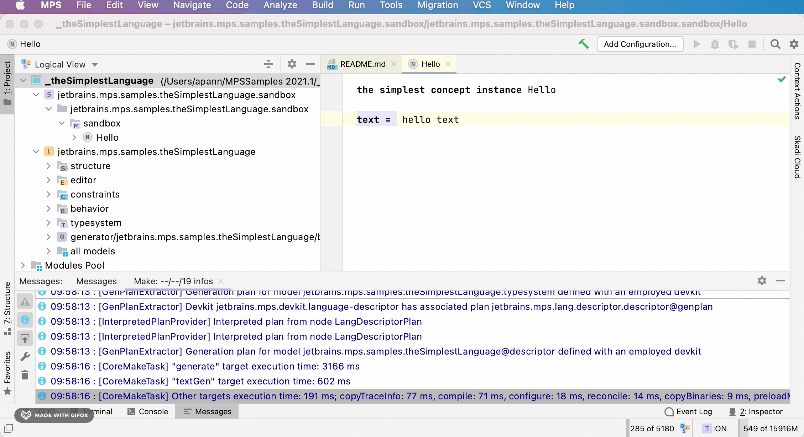
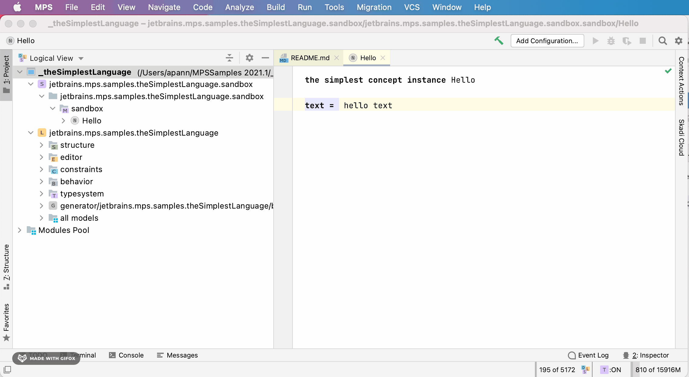
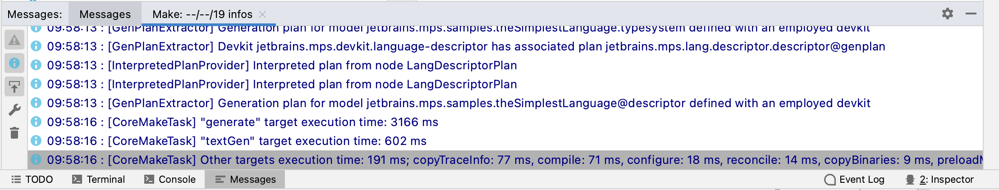

!!! question "Who is MPS for?"
    Specific Languages Blog &mdash; [Who is MPS for?](https://specificlanguages.com/posts/who-is-mps-for/){target=_blank}

!!! warning "I have a problem that is not in this list."

    Try <span class="hover_img"><a href="https://www.jetbrains.com/help/mps/invalidate-caches.html">invalidating the cache<span></span></a></span> and restarting MPS (same menu). Search the [forum](https://mps-support.jetbrains.com/hc/en-us/community/topics) and [issue tracker](https://youtrack.jetbrains.com/issues/MPS). 
    Ask a question on [Slack](http://slack-mps.jetbrains.com).

!!! warning "I changed something in a settings page and nothing changed."

    There might be a bug related to caching. Reopening the dialog or invalidating the cache or restarting the project might help.

!!! question "Are there any recommended MPS settings that should be changed?"
    The <span class="hover_img"><a href="https://www.jetbrains.com/help/mps/tuning-the-ide.html#common-jvm-options">maximum heap size<span></span></a></span> setting should be changed to a higher values such as 8 GB when using many languages or plugins.

!!! warning "I am running low on memory or MPS is running slowly. What can I do without restarting MPS?" 
    When you have enabled the <span class="hover_img"><a href="https://www.jetbrains.com/help/mps/status-bar.html?q=memory%20indicator#status-bar-icons">loaded models indicator<span></span></a></span> in the lower right corner of the screen, you can click on the text to [unload not needed models](https://confluence.jetbrains.com/display/MPS/What%27s+New+in+2019.3#What'sNewin2019.3-Modelunloading).
    The memory indicator at the same location can be used to free memory. As a last resort the <span class="hover_img"><a href="https://www.jetbrains.com/help/mps/status-bar.html?q=Power%20Save#status-bar-icons">power saving mode<span></span></a></span> can be enabled which disables background tasks such as the model checker.

!!! questions "What is the difference between a module and a model?"
    Specific Languages Blog &mdash; [Ambiguous terms: Modules and models](https://specificlanguages.com/posts/2022-02/25-ambiguous-terms-modules-models/){target=_blank}

!!! question "What is a SRepository and how is it structured?"
    The answer can be found in the MPS source code[^1].There can be multiple repositories available. Given a repository, references to modules/models/nodes can be resolved.
    There's no need in making ids unique globally as each subsystem knows, which exact repository it needs to use at any moment.
    (e.g. the type-system knows where it stores its type-nodes, so it will not try to resolve references to them )

    A repository contains modules, modules have model roots, each model root can load models.
    Also a module can be a models container itself (without model root).
    A model is then a set of "root" nodes.
    Each "root" node is a root of a tree of nodes. So that overall, repository is a tree structure.

    ```kroki-mermaid
    %%{init: {'theme':'base'}}%%
    graph LR;
    REP[(repository)]
    MOD1[[module 1]]
    MOD2[[module 2]]
    MODN[[module n]]

    REP --> MOD1;
    REP --> MOD2;
    REP --> MODN;
    MOD2 --> MR1[\model root 1\];
    MR2 --> MD1{model 1};
    MD1 --> RN1(root node 1);
    MD1 --> RN2(root node 2);
    MD1 --> RNN(root node n);
    MOD2 --> MR2[\model root 2\];
    MOD2 --> MRN[\mmodel root n\];
    ``` 

!!! question "Are there other languages besides Base Language?"
    Have a look at the [MPS Languages Repository](https://confluence.jetbrains.com/display/MPS/MPS+Languages+Repository?_ga=2.190406190.441906427.1635067376-1212584208.1633605628).

!!! question "Is there an existing expression/scripting language?"

    There is the expressions sample project. For a full language that can also be evaluated, have a look at
    [KernelF](http://voelter.de/data/pub/kernelf-reference.pdf) available at [iets3.opensource](https://github.com/IETS3/iets3.opensource).

!!! question "How do I organize large projects in MPS?"
    Read the two answers in [this thread](https://mps-support.jetbrains.com/hc/en-us/community/posts/360010373120-How-to-organize-large-projects-in-MPS-).

!!! question "How to I debug MPS projects?"
    Have a look at [this blog post](https://dslfoundry.com/how-to-debug-in-mps/) or [this guide](../../files/mps_debugging.pdf).

!!! question "Where are my log messages?"
    `log info` logs to the MPS log file <span class="hover_img"><a href="https://intellij-support.jetbrains.com/hc/en-us/articles/207241085-Locating-IDE-log-files">idea.log<span></span></a></span>, `message info` logs to the <span class="hover_img"><a href="https://www.jetbrains.com/help/mps/messages-tool-window.html">messages view<span></span></a></span>.

!!! question "Which log level should I use?"

    Have a look at [this Stack Overflow answer](https://stackoverflow.com/a/2031209).

!!! question "How to I export data from MPS?"
    - Specific Languages Blog &mdash; [The simplest way to export your data from MPS](https://specificlanguages.com/posts/simplest-export-from-mps/){target=_blank}
    - Specific Languages Blog &mdash; [Good and bad ways of exporting DSL models](https://specificlanguages.com/posts/good-and-bad-ways-of-exporting-dsl-models/){target=_blank}
    - Specific Languages Blog &mdash; [Translation vs export](https://specificlanguages.com/posts/translation-vs-export/){target=_blank}

!!! question "Why is my project suddenly read-only?"
    Specific Languages Blog &mdash; [Why is my project suddenly read-only?](https://specificlanguages.com/posts/2022-03/11-why-is-my-project-read-only/){target=_blank}

??? question "How do I work with multiple projects in MPS?"

    > Given I want to work on a MPS project that uses other projects and I want to switch between tasks that sometimes need changes on both, in the dependent project and the root project. I would like to switch back and forth between using the default prepackaged project dependencies and my own repository of them where I build them myself. How could I do that?

    **Option 0**: Open multiple projects in MPS at the same time

    - Works when doing small changes
    - fast
    - unreliable: when changing dependencies in my source models, this leads to a reload operation on the repository, which sometimes messes up the loaded repository and caches

    **Option 1**: Publish and pull from local maven

    - reliable
    - [example](https://github.com/IETS3/iets3.opensource/wiki/Building-IETS3#building-against-local-mbeddr)
    - 

    - gradle script needs to be told to pull from local repository
    -- e.g. by providing `-PforceLocalDependencies` to iets3
    -- or use dependency overrides

    **Option 3**: Changing project libraries

    - does not affect command line builds

    **Option 3a**: Command line setup Task
    We usually have a `./gradlew setup` task in our projects that replaces your `.mps/libraries.xml`. When you want to change the project, you'll need to change the configuration of that command line setup task and rerun it.

    **Option 3b**: MPS "Path variables" in Settings (deprecated)

    In the MPS setttings, I can configure path variables that can be used in my `.mps/libraries.xml` to pinpoint to the location of a target project.

    They will only configure your MPS behavior and not affect the command line builds. So in most cases, you'll not want to use them and instead let your build script setup these files.

    <sub>Contribution by: [@abstraktor](https://github.com/abstraktor)<sub>

[^1]: [SRepository.java](https://github.com/JetBrains/MPS/blob/78a8983d975c3177461ae2553fd253bdc63baab6/core/openapi/source/org/jetbrains/mps/openapi/module/SRepository.java#L24)
