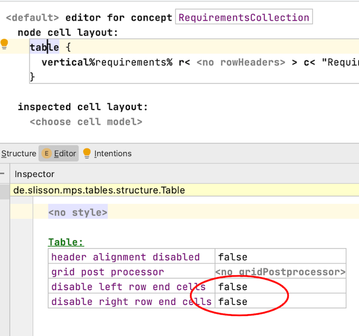

# Editor

## Checkboxes

### Simple
Language: ^^de.itemis.mps.editor.bool^^

- boolean checkbox
- provides custom icons for states

### Enumeration/Multi-value
Language: ^^de.itemis.mps.editor.enumeration^^

- checkbox with multiple states
- states are defined by an enum-property

## Richtext
Language: ^^slisson.richtext^^

- multi-line text-block
- easy to extend, e.g. images
- looks a bit latex-like
- is used in mbeddr-doc language for generating xhtml, latex and markdown

!!! warning "The ordering of text and IWords can't be arbitrary,"

    A checking rule enforces that the text is normalized: There has to be at least one child, it must start with a Word and a Word must always be betweeen two embedded nodes and there are noo two consecutive Words.

## Multiline property cell
Language: ^^de.slisson.mps.editor.mulitline^^

string properties over multiple lines

## Diagram
Language: ^^de.itemis.mps.editor.diagram^^

!!! warning "I encountered a bug."

    Check the [meta Issue](https://github.com/JetBrains/MPS-extensions/issues/120) on Github.

!!! question "How do I use this language?"

    Have a look at the samples of this language in [mps-extensions](https://jetbrains.github.io/MPS-extensions/). There is also an [external tutorial series](https://tillschallau.de/mps/).

!!! question "What is edge ID in the diagrams used for?"

    It’s used in the map that contains the layout data. It can be any unique string.
    LayoutMapEntry.key is the property where this string is used ([source](https://jetbrains-mps.slack.com/archives/C99H1FR42/p1634132395020500?thread_ts=1634127497.019400&cid=C99H1FR42)).

## Conditional Editor
Language: ^^de.slisson.mps.conditionalEditor^^

!!! warning "There are generation errors."

    The condition of the conditional editor is not optional, it has to be set.

## Tables
Language: ^^de.slisson.mps.tables^^

- displays content in tabular format
- can be (partially) hard-coded and/or consist of complex queries/ dynamic content
- add new cells and rows in the editor; or it can be just readonly
- needs a little experience (trial-and-error)
- Features
    - table cell query
    - partial table
    - grid query
- Strumenta Blog &mdash; [Tabular projections in Jetbrains MPS: let’s start building an accounting system](https://tomassetti.me/tabular-projections-in-jetbrains-mps-lets-start-building-an-accounting-system/) 
- use slisson-tables instead of mps-tables because it is more flexible (and not deprecated)

!!! question "How to get rid of the small little extra grid lines on the outside of the table rows? ([original question](https://jetbrains-mps.slack.com/archives/C99H1FR42/p1632226340005700))"

    Change these properties to `true`. 

## Cell Layout
Language: ^^de.itemis.mps.editor.celllayout^^

!!! question "What does this language do?"

    In the MPS layout algorithms the children decide about their width and height and the parent cell can only arrange the already layouted children. 
    In the algorithms from the celllayout language are similar to the swing layouters where the child is asked for its min/max/preferred size, 
    but the parent decides about the size of the child and the child then has to fit itself into these bounds. 
    This is used in tables and diagram, but also for the styles defined in the `de.itemis.mps.celllayout` language ([source](https://jetbrains-mps.slack.com/archives/C99H1FR42/p1626868877018500?thread_ts=1626861485.018300&cid=C99H1FR42)).

# Grammar Cells
Language: ^^de.itemis.mps.grammarcells^^

!!! question "Grammar cells force me to create a dummy component. Is this really necessary?"

    Yes it is, otherwise the generator doesn't get used [source](https://jetbrains-mps.slack.com/archives/C3YUV3YK0/p1628146601046300).

!!! question "What combination of cells are not supported?"

    The following combinations are not allowed:

    - optional and constant
    - optional and reference

!!! question "How can enter enumerations easier?"
    Specific Languages Blog &mdash; [Entering enumerations easier with grammar cells](https://specificlanguages.com/posts/2022-02/03-entering-enumerations-easier/){target=_blank}

# Querylist
Language: ^^com.mbeddr.mpsutil.editor.querylist^^

- Displays node(s), which are not directly accessible by, thus instead via query.
- more powerful than (readonly-)-model-access (displays a string)
- editor-cells, which can have actions, etc.
- [queryListNode](http://127.0.0.1:63320/node?ref=120e1c9d-4e27-4478-b2af-b2c3bd3850b0%2Fr%3Aea4f2df6-5e5c-49de-8679-6112ec7dd9c3%28com.mbeddr.mpsutil.editor.querylist%2Fcom.mbeddr.mpsutil.editor.querylist.structure%29%2F2239254897981410197): access the surrounding context-node in the editor definition (which otherwise is not accessible)

!!! question "How do I fold collections returned by a querylist?"

    Surround the querylist with a vertical collection and and set the cell layout of the querylist (not its content) to vertical.

# Tooltips
Language: ^^de.itemis.mps.tooltips.structure^^

- tooltips on hover
- A regular editor and a hover editor must be defined..
- deprecated; use `jetbrains.mps.lang.editor.tooltips` instead.

# Dropdown
Language: ^^de.itemis.mps.dropdown^^

- Surrounds an editor cell with a dropdown cell + button. 
- When clicked, opens the code completion menu.
- probably not very stable

# Collapsible cells
Language: ^^de.itemis.mps.editor.collapsible^^

- defines collapsed/folded and expanded/unfolded editors
- provides plus(+) and minus(-) buttons in the editor
- no need for foldable collections
- can be used for example in combination with query-lists

# Mathematical operators
Language: ^^de.itemis.mps.editor.math.notations^^

- embeds mathematical operators into the editor
- provides a set of predefined operators