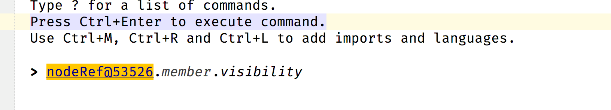

The MPS console, not to be confused with the terminal, provides the ability to execute (mainly Base Language code) on the command
line. It supports special commands starting with a hash sign to achieve common tasks such find nodes (`#nodes`) or cleaning the
generates files (`#clean`). It is meant to be used by developers, but might be useful for users it they get stuck.
Additional to the provided commands, you can use it for the following common tasks:

- Selecting a node in the editor and modifying it: In certain cases, the console can be the only way to make changes when even
  the reflective editor fails.
- Writing new code faster: The `#print` statements can, for example, provide detailed feedback when testing new code. New Ideas
  can be quickly prototyped and executed by a single mouse click.
- Exploring: You can check the output of single expressions or query nodes/models/modules to learn more about them. When dealing with
  unknown nodes, it makes sense to output their concept (`myNode.concept`) or navigate to it by clicking on it. You can access node annotations
  through myNode.@annotationRole. Make sure to import the annotation's dependency or it its role won't be visible
  (e.g. import [SuppressErrorsAnnotation](http://127.0.0.1:63320/node?ref=r%3A00000000-0000-4000-0000-011c89590288%28jetbrains.mps.lang.core.structure%29%2F4222318806802425298) to have `myNode.@suppress` available)
- Debugging: Like exploring, the console is a great tool for figuring out why something doesn't work. Paste short code snippets 
  directly into the console and observe the intermediate results if you don't want to use a debugger. One common source of errors
  are model queries that return an empty list because of wrong conditions or structural assumptions (e.g. concept X is not a descendant of concept Y).
  Play around with your query. Remove parts of the query, check the scope or output intermediate returned results.
- Search for usages of concepts or nodes with a condition: `#instances` and `#nodes` can be combined with a scope and further
  queries to constrain the amount of results. Ensure to not use too expensive queries (e.g. `#nodes<scope = global>`) or else 
  you might wait for your results for a while.

## Example queries

Find the action declaration for *Show Node in Explorer*: 

```java
#instances<scope = global>(ActionDeclaration).where(
  {~it => it.caption != null && it.caption.contains("Show Node in Explorer"); })
```

Delete all instances of a deprecated node in the project (with preview):

```java
#instances(ClassConcept).refactor({~node => node.detach; })
```

Delete all generates files in the project.

```java
{ 
  #clean(<project>); 
  #removeGenSources(<project>); 
}
```

Query classes for a specific property and collect some results.

```java
{
    nlist<> results = new nlist<>; 
    #instances(ClassConcept).where({~it => it.getFqName().startsWith("com.mbeddr") && it.constructors().isNotEmpty; }).forEach({~it => results.addAll(it.fields()); });
    #print results;
}
```

Find all installed modules and their descriptor files:

```java
#modules<scope = global>.where({~it => it.isPackaged(); }).select({~it => 
  AbstractModule module = ((AbstractModule) it); 
  module.?getDescriptorFile().?toRealPath(); 
})
```

!!! warning "I can't enter the print statement :beginner:"

    Nested structures don't support it (MPS-34656). Use it at the top level instead. If you need to output multiple objects,
    save them to a list first and output the list at the top level.

!!! question "How can you enter more than one statement into the console?"

    Enter an opening [curly brace](http://127.0.0.1:63320/node?ref=r%3A359b1d2b-77c4-46df-9bf2-b25cbea32254%28jetbrains.mps.console.base.structure%29%2F5464054275389846505) (this starts a new statement list in Base Language) and enter your statements.

!!! question "How can you find all System.out.println statements?"

    [Code snippet:](https://gist.skadi.cloud/gist/13dECMxlPy0WVy1E6wBEUc)

    ]

!!! warning "#nodes, #models, #usages, etc., don't show any result :beginner:"
    Make sure that your query is correct. You must also set a scope for these statements in square brackets, such as
    `#!java #nodes<scope = global>`, to find all the nodes in the global scope.

!!! question "Is the console a regular root node?"

    Yes, it is an instance of [ConsoleRoot](http://127.0.0.1:63320/node?ref=r%3A359b1d2b-77c4-46df-9bf2-b25cbea32254%28jetbrains.mps.console.base.structure%29%2F1583916890557930028)
    and belongs to a temporary model. It is possible to open it in a regular tab. Right-click in the console (for example, at the top) and click 
    *Show Node in Explorer*. Click the *ConsoleRoot* to open it in a new tab  (keyboard shortcuts such as run line won't work here).

!!! warning "After executing the current line, an error says that the compiler couldn't find the console class."

      You might have a dependency on some model, that interferes with the console's classpath. Make sure that you don't have any
      broken references in previous console items or press *Clear* to delete all items except the current one. If nothing helps,
      restart MPS.

    This error can also happen when the console's compilation of the model is unsuccessful or if you import a custom generation
    plan into the console that turns off some generators. It can also occur if you import a solution that doesn’t enable the Java facet or has a different solution (e.g., *other*).

!!! question "What does the expression #internalMode do?"

    It tells you if the internal mode is activated. Activate it by calling [RuntimeFlags.setInternalMode(true)](http://127.0.0.1:63320/node?ref=6ed54515-acc8-4d1e-a16c-9fd6cfe951ea%2Fjava%3Ajetbrains.mps%28MPS.Core%2F%29%2F%7ERuntimeFlags)
    or setting a system variable. Start MPS with argument `#!properties -Dmps.internal=true` or add `#!properties mps.internal=true` to the *mps.vmoptions* file: use *Main menu* -> *Help* -> *Edit Custom VM Options*. The [MPS sources](https://github.com/JetBrains/MPS/search?q=isInternalMode&type=code) contain references to this flag in various places.
    One of the new action groups that it adds is called *Internal*. There is also an Internal Actions Menu in the IntelliJ IDEA. Consult the [documentation](https://plugins.jetbrains.com/docs/intellij/internal-actions-intro.html)
    for more info.

!!! question "How do you open the selected node in the console? :beginner:"

    > Given I have a node selected in the editor. How can I reference it to manipulate it in the MPS console?

    {{ question_by('AlexeiQ') }}

    You can copy the node and paste it into the console:

    1. Copy a node in the editor (++cmd+c++ or ++ctrl+c++)
    2. Go to the console.
    3. Paste the content   (++cmd+v++ or ++ctrl+v++)
    4. MPS pastes a node reference that you can use to manipulate the node directly:

    {width="600px"}

    {{ answer_by('coolya') }}