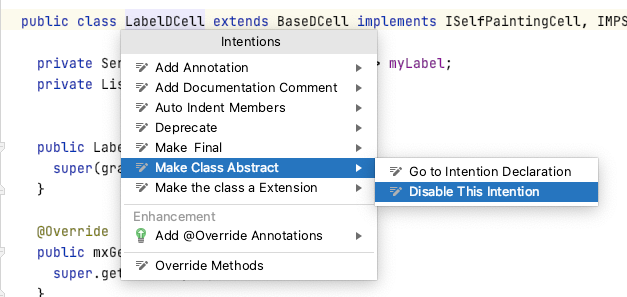
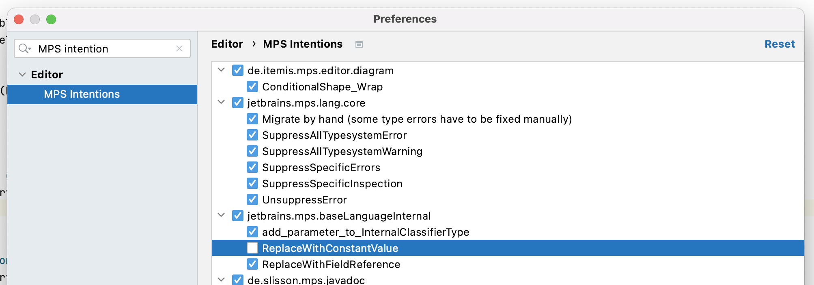

---
tags:
- troubleshooting
- settings
---

# Troubleshooting guide

This is a non-exhaustive list of common problems with MPS and platform projects. It is assumed that Gradle is used for building the project.
For general MPS problems, read [Finding your way out](https://www.jetbrains.com/help/mps/finding-your-way-out.html) first.
If you are still stuck with your problem, read [overcoming obstacles](overcoming_obstacles.md) next.

## MPS and MPS Platforms

The following questions assume that you use Gradle to build your project. The README file of your project should have
more information about common issues and how to build the project.

When you build an MPS project, it can make a big difference between removing all generated files first and building the project (clean build), or skipping the first step (dirty build). When doing CI, you have to do a clean build or certain kind of errors can't be detected.

For checking out a different branch, a dirty build or rebuilding the
languages manually can be the faster option. When you didn't do any generator changes or other changes that require a rebuild,
calling make on the changed languages can be even enough.

Which type of build you choose is up to you and highly depends on the project. Experience with it in your team, and
compare if the risky dirty build is worth the time you save.

!!! warning "The IDE is sluggish and doesn't work the way it should."

    Edit the file mps(64).vmoptions and give it sufficient heap space: `-Xmx8g`

!!! warning "MPS behaves strangely :beginner:"

    > For instance: claims that a method is missing, although it exists.

    1. Check if you have mixed dependencies for different MPS versions or are opening the project with the wrong MPS version.
    2. *Tools* --> *Reload All Classes*.
    3. *File* --> *Invalidate Caches*, then restart.
    4. *File* --> *Invalidate Caches*, shutdown MPS; in the repository in question: run `git clean -fxd -e build.properties -e gradle.properties`, rebuild with Gradle (`./gradlew`), restart MPS.

    Try [invalidating the cache](https://www.jetbrains.com/help/mps/invalidate-caches.html) and check what other non-MPS
    plugins you have installed. Some IntelliJ plugins that can be found on the marketplace can interfere with
    MPS plugins, for example, make the indexing break or throw errors because they expect a text editor and not the projectional
    editor from MPS. Firewalls and [proxies](https://www.jetbrains.com/help/mps/settings-http-proxy.html) could also affect MPS negatively.

!!! failure "MPS freezes on startup."

    There can be multiple reasons for freezes at startup:

      - an infinite loop in an application/project plugin
      - wrong usage of threading mechanisms that lead to a [deadlock](https://www.javatpoint.com/deadlock-in-java).
      - the startup module maker compiles not built modules
      - a deadlock occurs because some code interferes with [indexing](https://plugins.jetbrains.com/docs/intellij/indexing-and-psi-stubs.html#indexes) files

    If you know the offending module/model, the simplest solution is to delete the generated files in the file explorer (source_gen/classes_gen). Then fix the error and recompile the module/module.When you are unsure where the error comes from, you can do [remote debugging](https://specificlanguages.com/articles/debugging/). There is also the `dontReopenProjects` command line flag to not open the last project when starting MPS. It helps to access the general settings or to remove plugins.

!!! failure "MPS cannot find languages/solutions."

    > For instance: "language X is not deployed" errors.

    1. *File* --> *Invalidate Caches*, shutdown MPS.
    2. Run `./gradlew setup --refresh-dependencies`.
    3. Start MPS again.

    There could also be some other reasons:

    - A wrong version of the platform is used, for example, {{ mps_extensions() }} 2021.1 with MPS 2021.2. The major and minor versions have
    to be the same. Bug fix versions (e.g., 2021.1.4) should be compatible with the major/minor version of the platform.
    In rare cases, there can be an incompatibility because a bugfix/feature was backported from a newer MPS version, and the change
    is a breaking change.
    - Make sure that MPS is started with the correct Java version (execute the *Choose Boot Runtime for the IDE* action) and check
    that the bundled JBR or an external JBR/JRE is used. Another runtime could be selected by accident (e.g., a [GraalVM](https://www.graalvm.org/) runtime)
    - If you want to use [JCEF](https://plugins.jetbrains.com/docs/intellij/jcef.html), it must be a JBR runtime that [includes
    JCEF](https://github.com/JetBrains/JetBrainsRuntime/releases).
    - An MPS plugin was disabled (e.g., Java Debugger for MPS) that a language depends on.
    - For mbeddr, [three plugins need to be installed](http://mbeddr.com/mps-platform-docs/mbeddr/?h=actionsfilter#:~:text=i%20am%20using%20some%20mbeddr%20languages%20in%20my%20project%20but%20some%20of%20them%20aren%E2%80%99t%20deployed.) to avoid languages that can't be loaded because they have dependencies on one of the three plugins.
 
!!! warning "The IDE doesn't let you enter some text / an intention isn't visible that should be there."

    1. Check: Was the intention disabled by the user by accident?

    

    In this case, the intention can be enabled through preferences --> MPS intentions and manually searching for the disabled intention:

    

    2. Check: Is the concept/intention visible in the model? (open a context menu where Base Language code is allowed and search for classes/concepts from the same language)
        - :octicons-x-circle-16: --> Use *Edit* --> *Add Language Import* to import the language containing the concept / the intention.
    3. Check the concept: Is the concept's type suitable for the place where you want to create an instance? Does it implement the right interface?
    4. Check the intention: Is the `#!java isApplicable()` method called? (add a `#!java System.err.println()` to the method and check what MPS outputs)
        - :octicons-x-circle-16: --> The intention is most probably not visible in the model --> see above
        - :octicons-check-circle-16: --> Make sure the method returns true
    5. Concept: Does a constraint on one of the ancestor nodes prohibit you from creating it?

!!! failure "MPS build fails :beginner:"

    1. Does the MPS Model-Checker report problems? :octicons-check-circle-16: --> Fix identified problems.
    2. Does the build log report intelligible problems? :octicons-check-circle-16: --> Fix identified problems.
    3. Does it build in Gradle? :octicons-x-circle-16: --> See: [Gradle-Build fails](#gradle).

!!! failure "MPS can't be started at all."

    There could be multiple reasons:

    - One reason could be a wrong Java version. That could be a different Java runtime like the GraalVM or an incorrect Java version.
    MPS 2022.2 and newer need JDK 17, older ones need JDK 11, and ancient versions of MPS need JDK 8.
    - Through external changes, files of an MPS project could get deleted or corrupted by accident (such as deleting *model* files). There should be an
    exception that should give a hint of why the startup fails. The [log file](https://www.jetbrains.com/help/mps/directories-used-by-the-ide-to-store-settings-caches-plugins-and-logs.html#logs-directory) should also contain an error message.

!!! failure "Basic MPS functionality stops working (e.g., typing doesn't work, the editor has an incorrect layout, or the window turns blank)."

    If you are not using one of the platforms, you should report the issue to the [MPS issue tracker](https://jetbrains.github.io/MPS-extensions/extensions/editor/celllayout/). Most of the bugs are caused by languages or plugins in {{ mps_extensions() }}/{{ mbeddr_platform() }}.
  
    For editor-related issues, try pressing ++f5++ and check if the *relayout* method of the editor fixes the editor. If it does, report an issue in {{ mps_extensions() }}.
    The most likely culprit is the [cell layout](https://jetbrains.github.io/MPS-extensions/extensions/editor/celllayout/) language.
    If another basic editor functionality like typing doesn't work anymore, the same language or another language in the same repository can cause such issues.
    For all other issues, check if a fatal error was thrown in the lower right corner.
  
    Visit the [issue tracker reference](issue_trackers.md) page to find the right issue tracker
    when you can't identify the repository based on the package name in the error message. Please don't just report the issue to the
    [JetBrains MPS issue tracker](https://youtrack.jetbrains.com/issues/MPS) because the issue will likely be marked as invalid and
    doesn't land in the right issue tracker.

## Gradle

[Gradle | Build](gradle.md) gives some more details about working with this build tool. When working with Gradle, make sure
that you know which versions you are using. Different Gradle versions support [different Java versions](https://docs.gradle.org/current/userguide/compatibility.html). Another topic that often leads to syntax issue, is [lazy configuration](https://docs.gradle.org/current/userguide/lazy_configuration.html) which delay calculations until it's actually required.

!!! failure "Gradle build fails."

    1. Did you call `git clean -fxd -e build.properties` before `./gradlew`? :octicons-x-circle-16: --> Do it, retry.
    2. Did you call `./gradlew` with `--refresh-dependencies`? :octicons-x-circle-16: --> Retry with `--refresh-dependencies`.
    3. Does the error message start with: *dependencies should be extracted into the build script*?
        - In MPS, apply the model-checker to the "build"-package. Many problems can be fixed by applying the intention "Reload modules from disk."
        - Rebuild the "build"-package.
        - Retry the gradle build.
    4. Do you have local changes?
        - :octicons-check-circle-16: --> Use `git stash` to stash them away and retry.
        - When the build works without your changes, then your changes are the problem. Redo them one by one to find the one that causes the problem.
    5. Does it work on CI?
        - :octicons-check-circle-16: --> Is it a recent CI build?
            - :octicons-x-circle-16: --> Retrigger via a whitespace-only commit.
            - :octicons-check-circle-16: --> Search for differences between your local Gradle build and the CI build (versions).
        - :octicons-x-circle-16: --> Is it the same error message?
            - :octicons-x-circle-16: --> Search for differences between your local Gradle build and the CI build (versions).
        - Is the main build green on CI?
            - :octicons-x-circle-16: --> Find out who broke it and make him fix it. After it is fixed, continue.
        - Is the main build recent?
            - :octicons-x-circle-16: --> Retrigger it via a whitespace-only commit.
            - :octicons-check-circle-16: --> Merge main into your branch and retry.
    6. If nothing helped: try cloning your repo again.
    7. You are out of options. Ask somebody for help.

## CI

!!! warning "Tests are failing on CI but are green in the local MPS installation."

    What about the local Gradle build?
    The tests can be executed locally with `./gradlew ant-build-tests -Dmps.home=PATH_TO_YOU_MPS_INSTALLTION`. The test results can be found in `build/iets3-allScripts` ({{ iets3() }}).

    - If it runs (green), then there is a discrepancy between the CI and your local Gradle build.
        - Make sure you are on the same branch/commit as the CI,
    - If it shows the same test failures as the CI, then there is a discrepancy between the MPS Build and the Gradle Build.
        - Rebuild the build scripts in MPS.
        - Try running the tests in a separate process (edit the run configuration in MPS).
        - Make sure your MPS uses the same (versions of the) dependencies as the gradle build.
            - This can be achieved in 2 different ways:
                - Run `./gradlew dependencies` to see which versions of which dependency gradle uses and
              make sure the OS and Mbeddr repos are checked out on the right branches/commits ({{ iets3() }}).
                - Remove the file *projectlibraries.overrides.properties* from your repo and execute
              `./gradlew setup` in both. This configures MPS to directly use the Java class files from the Gradle artifacts instead of the checked-out repos.

## Explanations

- *git clean -xdf*
    - removes untracked files from the working tree (= also files generated by MPS)
    - *x*: Remove only files ignored by Git. This may be useful to rebuild everything from scratch but keep manually created files.
    - *d*: Remove untracked directories and untracked files.
    - *f*: If the Git configuration variable clean.requireForce is not set to false, git clean will refuse to delete files or directories unless given -f, -n or
    - *e*: Use the given exclude pattern besides the standard ignore rules.