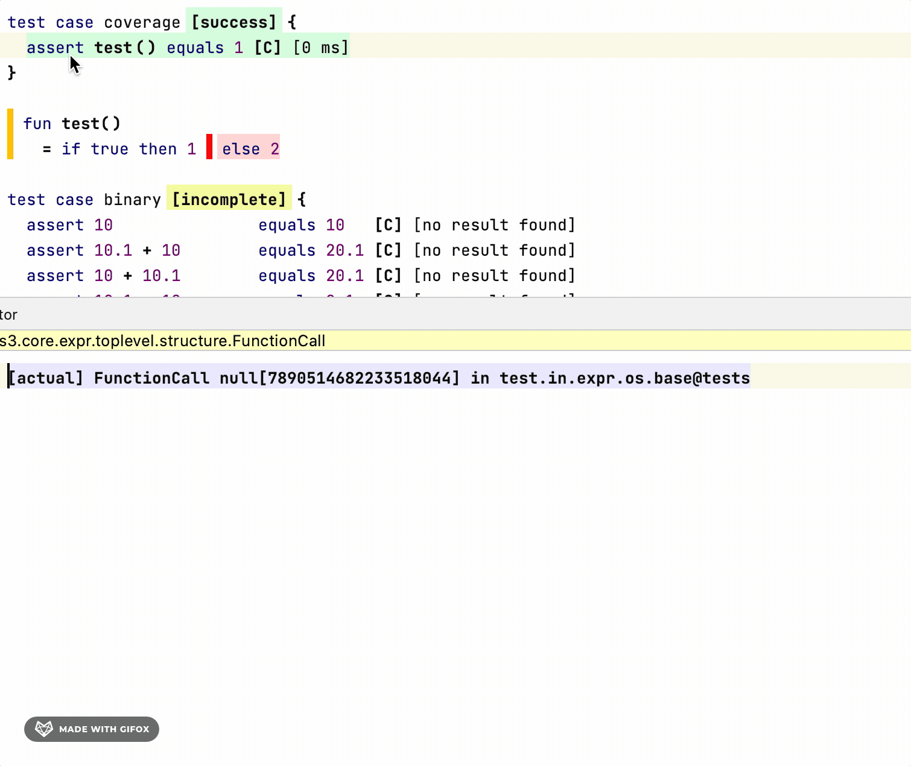
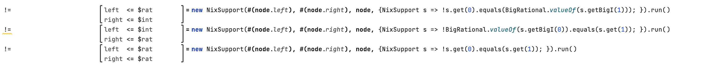

---
tags:
- iets3
alias: kernelf
---

Please start with the [readme file](https://github.com/IETS3/iets3.opensource) of the [iets3.opensource](https://github.com/IETS3/iets3.opensource)
repository. The primary documentation is the book [DESIGN, EVOLUTION, AND USE of KernelF](http://voelter.de/data/books/kernelf-designEvoUse.pdf) by Markus Voelter. There's also a [short reference](http://voelter.de/data/pub/kernelf-reference.pdf) with only 27 pages.

## Language Implementations

- [Unpacking Options Values: A Case Study in Language Design](https://languageengineering.io/unpacking-options-values-a-case-study-in-language-design-3f67c0a9696f)
- [The Evolution of Decision Tables](https://markusvoelter.medium.com/the-evolution-of-decision-tables-80ce77bf984c)

Multi-Party boolean decision table:

- [A Smart Contract Development Stack](https://languageengineering.io/a-smart-contract-development-stack-54533a3a503a)
- [A Smart Contract Development Stack, Part II: Game Theoretical Aspects](https://languageengineering.io/a-smart-contract-development-stack-part-ii-game-theoretical-aspects-ca7a9d2e548d)

## Mutable State

- [Dealing with Mutable State in KernelF](https://markusvoelter.medium.com/dealing-with-mutable-state-in-kernelf-e0fdec8a489b)

## Functional Programming

- [Some Concepts in Functional Languages](https://languageengineering.io/some-concepts-in-functional-languages-550c683a0ffa) (languageengineering.io)
- [Introduction to the functional programming jargon (general)](https://github.com/hemanth/functional-programming-jargon)
- [Awesome functional programming (general)](https://github.com/lucasviola/awesome-functional-programming)
- [Funclerative Programming](https://markusvoelter.medium.com/funclerative-programming-968cc53ee580)(Markus Voelter)

## Tracing

The execution trace is helpful if you want to follow the execution path of an interpreter. Right-click an interpreted node and click *Show Trace*. The trace explorer now opens in the lower left corner. When you click one of the lines in the trace explorer, the node in the editor gets replaced by the trace. You can manipulate the trace through the *trace expression*.

## Nix

KernelF doesn't allow returning null values (intermediate null values that the same or other evaluators catch are fine).
Instead, it supports so-called nix handlers (there's a [nixHandler extension point](http://127.0.0.1:63320/node?ref=r%3A6c6155f0-4bbe-4af5-8c26-244d570e21e4%28org.iets3.core.expr.base.plugin%29%2F2417394483934994140)). The default handler for KernelF is [DefaultNixHandler](http://127.0.0.1:63320/node?ref=r%3A6c6155f0-4bbe-4af5-8c26-244d570e21e4%28org.iets3.core.expr.base.plugin%29%2F2417394483935015244).
A nix value (interface [INixValue](http://127.0.0.1:63320/node?ref=r%3A5db517a0-f62d-4841-a421-11bb7269799d%28org.iets3.core.expr.base.shared.runtime%29%2F3889855429449824409)) represents an empty (nothing) value. There is, for example, a [DefaultNix](http://127.0.0.1:63320/node?ref=r%3Aac28053f-2041-47f6-806b-ecfaca05a64a%28org.iets3.core.expr.base.runtime.runtime%29%2F3889855429449859911) class; for dates, there's [EmptyDateRangeValue](http://127.0.0.1:63320/node?ref=r%3Aa9ac3767-b241-4aa4-a973-d04bb5ce184c%28org.iets3.core.expr.datetime.runtime%29%2F5551088970758352208). Use the handler's method *process* to handle values that might be nix. To use this feature call `new NixSupport(Object value node<> node {NixSupport => Object} calculator).run()` where the calculator returns the value:

