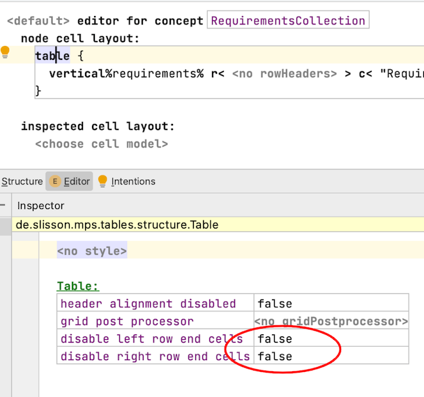
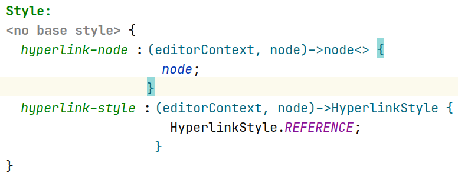
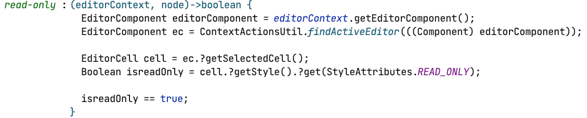

---
tags:
- mps_extensions
---

**[GitHub](https://jetbrains.github.io/MPS-extensions/) contains the official documentation.**

## Richtext

> ^^slisson.richtext^^

This language provides an extendable multi-line text block (e.g., for images).
The mbeddr doc language uses it for generating XHTML, Latex, and markdown.

!!! warning "The ordering of text and IWords can't be arbitrary,"

    A checking rule enforces that the text is normalized: There has to be at least one child, it must start with a `Word`, a `Word` must always be between two embedded nodes, and there are no two consecutive Words.

## Diagram

> ^^de.itemis.mps.editor.diagram^^

!!! question "What Java libraries are used by the diagram language?"

    For the graphs itself, it uses [JGraphX](https://jgraph.github.io/mxgraph/docs/manual_javavis.html).[Eclipse Layout Kernel (ELK)](https://www.eclipse.org/elk/) layouts the diagram.

!!! warning "I encountered a bug."

    Check the [meta Issue](https://github.com/JetBrains/MPS-extensions/issues/120) on GitHub.

!!! question "How do you use this language?"

    Have a look at the samples of this language in {{ mps_extensions() }}. There is also an [external tutorial series](https://tillschallau.de/mps/).

!!! question "What's the edge ID in the diagrams used for?"

    It’s used in the map that contains the layout data. It can be any unique string.
    LayoutMapEntry.key is the property where this string is used ([source](https://jetbrains-mps.slack.com/archives/C99H1FR42/p1634132395020500?thread_ts=1634127497.019400&cid=C99H1FR42)).

## Tables

> ^^de.slisson.mps.tables^^

Use *slisson-tables* instead of *mps-tables* because the language is more flexible (and not deprecated).
The language displays content in a tabular format. The table can be hard-coded or contain complex queries/dynamic content.
You must add new cells and rows in the editor (they can be read-only). They include the following features:

- table cell queries
- partial tables
- grid queries

[Tabular projections in Jetbrains MPS: Let's start building an accounting system](https://tomassetti.me/tabular-projections-in-jetbrains-mps-lets-start-building-an-accounting-system/){{ blog('Strumenta') }}

??? question "How do you get rid of the small little extra grid lines on the outside of the table rows? ([original question](https://jetbrains-mps.slack.com/archives/C99H1FR42/p1632226340005700))"

    Change these properties to true. 

    

!!! question "How can I improve my tables?"

    - even-odd coloring of rows
    - coloring of columns and row headers
    - group columns by color
    - multi-column headers
    - annotations for cells
    - pagination + other UI buttons

## Grammar Cells

> ^^de.itemis.mps.grammarcells^^

!!! question "Grammar cells need a dummy component. Is this necessary?"

    Yes, it is. Otherwise, the generator doesn't get used ([source](https://jetbrains-mps.slack.com/archives/C3YUV3YK0/p1628146601046300)).

!!! question "What combinations of cells aren't supported?"

    The following combinations are not allowed:

    - optional and constant
    - optional and reference

!!! question "How can you enter enumerations easier?"
    
    [Entering enumerations easier with grammar cells](https://specificlanguages.com/posts/2022-02/03-entering-enumerations-easier/){{ blog('sl') }}

!!! question "How can I use the transformation language together with this language?"

    Do hide the substitute menu for a concept, create an empty substitute menu for it. When you want to add entries the traditional
    way through substitute menus, you have to use [substitute menu contribution](https://www.jetbrains.com/help/mps/transformation-menu-language.html#substitutemenucontribution) to not overwrite the automatically generated entries by the Grammar cells language.

## Querylist

> ^^com.mbeddr.mpsutil.editor.querylist^^

You can use nodes in the editor which aren't directly available in the current context. The language is more 
powerful than (read-only) model access (displays a string).
You can have editor cells with actions and all other regular cell features.
[queryListNode](http://127.0.0.1:63320/node?ref=120e1c9d-4e27-4478-b2af-b2c3bd3850b0%2Fr%3Aea4f2df6-5e5c-49de-8679-6112ec7dd9c3%28com.mbeddr.mpsutil.editor.querylist%2Fcom.mbeddr.mpsutil.editor.querylist.structure%29%2F2239254897981410197) allows accessing the surrounding context node in the editor definition (otherwise unavailable).

!!! question "How do I fold collections returned by a query list?"

    Surround the query list with a vertical collection and set the cell layout of the query list (not its content) to vertical.

??? question "How do I make cells in query lists navigatable?"

    > I'm creating a list of navigatable cells via a query list from mpsutil.
    >
    > The query lists query collects some nodes from my model, and I'd like to make it so that each cell produced with this query list navigates to its respective node.
    >
    > Using the *navigatable-node* style attribute (returning `node`, the node from the query) ) on these cells doesn't work, though - ctrl+clicking them doesn't do anything.
    >
    > How can I make the cells in a query list navigatable to that node?
    
    The `navigatable-node` style attribute won't allow you to point directly to the node from the query list's query.   
    Instead, you can use the *hyperlink-node* style attribute (also from mpsutil) to make the navigation work    and the `hyperlink-style` attribute to make it look like a regular reference:
    
      

    A common workaround to get similar behavior with *navigatable-node* is to point it to a child or parent of the desired node instead of that node itself.

    {{ contribution_by('jonaskraemer') }}

??? "How Do I make sure that the elements are also read-only in the Inspector?"

    I have a concept A which has children b of concept B. Another concept C references A. C uses a querylist in the editor to show the list b of children. 
    As C does not own the list b (A owns it) we aim to restrict access to 'read-only'. We are setting the 'read-only' style on the query-list.
    This ensures that the list b cannot be changed. But if the concept B has a property, which is editable in the inspector, then this apporoach
    does not work. We can still edit the property, even if the concept instances of B are displayed via a query-list. 
    To achieve this you have to setup a 'read-only' style in the inspector editor for B with a query: 

    

    This code snippet finds the main editor of C where the query-list is. Then it looks for the simple true/false 'read-only' style set on the query-list.

    {{ contribution_by('dbinkele') }}

## Tooltips

> ^^de.itemis.mps.tooltips.structure^^

This language is deprecated. Use the language ^^jetbrains.mps.lang.editor.tooltips^^ instead. It provides tooltips on hover.
You have to define a regular editor and a hover editor.