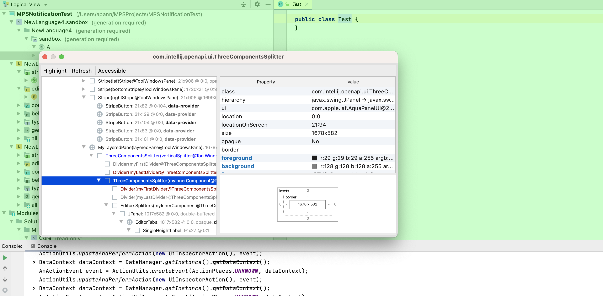

The following example shows the internal structure of MPS in regard to the [Swing](https://docs.oracle.com/javase/tutorial/uiswing/) components.
Most of the structure is predetermined by the IntelliJ platform. IntelliJ has a [UI inspector
](https://plugins.jetbrains.com/docs/intellij/internal-ui-inspector.html) for debugging purposes.
MPS turns it off by default, but you can enable it on the MPS console through the following code:

```java
DataContext dataContext = DataManager.getInstance().getDataContext(); 
AnActionEvent event = ActionUtils.createEvent(ActionPlaces.UNKNOWN, dataContext); 
ActionUtils.updateAndPerformAction(new UiInspectorAction(), event);
```



The following tree shows how the IDE is structured internally, from the main frame down to the light bulb menu.
Some entries, like menus or tabs, can occur more than once. The structure might be slightly different in another MPS
version because of the different versions of the IntelliJ platform.

=== "Structure"

    ```kroki-plantuml
@from_file:mps_internal/diagrams/ui_structure_example.puml
    ```

=== "Explanation"

    1. IntelliJ-specific implementation of [JFrame](https://docs.oracle.com/javase/tutorial/uiswing/components/frame.html)
    2. IntelliJ-specific implementation of [JRootPane](https://docs.oracle.com/javase/8/docs/api/javax/swing/JRootPane.html). It also contains the toolbar and [status bar](https://www.jetbrains.com/help/mps/status-bar.html).
    3. [RootPane](https://docs.oracle.com/javase/tutorial/uiswing/components/toplevel.html#rootpane)/[How to Use Root Panes](https://docs.oracle.com/javase/tutorial/uiswing/components/rootpane.html): The glass pane is often used to intercept input events occurring over the top-level container and can also be used to paint over multiple components.
    4. [RootPane](https://docs.oracle.com/javase/tutorial/uiswing/components/toplevel.html#rootpane)/[How to Use Root Panes](https://docs.oracle.com/javase/tutorial/uiswing/components/rootpane.html): The layered pane contains the menu bar and content pane and enables Z-ordering of other components
    5. IntelliJ-specific implementation of [JMenuBar](https://docs.oracle.com/javase/tutorial/uiswing/components/menu.html)
    6. IntelliJ-specific implementation of [JPanel](https://docs.oracle.com/javase/tutorial/uiswing/components/panel.html)
    7. an entry in the main menu
    8. the [navigation bar](https://www.jetbrains.com/help/mps/navigation-bar.html)
    9. the pane containing the tool window stripes
    10. the [status bar](https://www.jetbrains.com/help/mps/status-bar.html)
    11. the stripes containing the [tool window](https://www.jetbrains.com/help/mps/tool-windows.html) buttons
    12. a button opening a tool window
    13. the pane containing the main content
    14. Three components split by two dividers horizontally or vertically
    15. the window of the opened bottom tool
    16. the header and divider of 15
    17. the opened bottom tool window
    18. a tab in a tool window
    19. a panel containing the editor
    20. the opened left tool window
    21. the [document tabs](https://www.jetbrains.com/help/mps/editor-guided-tour.html#194d9944) enabling the navigation between opened editors
    22. the editor window
    23. A class hiding the internal structure of a UI component which represents a set of opened editors
    24. MPS version of an IntelliJ [document](https://plugins.jetbrains.com/docs/intellij/documents.html) editor
    25. the panel containing the MPS editor
    26. the [editor component](https://www.jetbrains.com/help/mps/editor.html#editorcomponentsandeditorcomponentcells) itself
    27. a pane supporting zooming with the mouse wheel and scrolling
    28. the vertical scrollbar of the editor component
    29. the horizontal scrollbar of the editor component
    30. the left editor highlighter ([left gutter](https://www.jetbrains.com/help/mps/editor-guided-tour.html#c1b7ec2d))
    31. an editor component for editing nodes
    32. the [intentions](https://www.jetbrains.com/help/mps/mps-intentions.html) menu
    33. [validation sidebar/marker bar](https://www.jetbrains.com/help/mps/editor-guided-tour.html#marker_bar)