# UI Patterns and Anti Patterns

Go through your editors and check the following list, which contains common patterns in MPS. Not all of them are good patterns
and should therefore be avoided.

!!! hint "Texts are readable."
    The contrast ratio between the background and foreground text colors should be at least 4.5:1 ([article](https://www.majesticsignstudio.com/blog/best-color-combinations-for-readability/)).
    [Contrast checkers](https://webaim.org/resources/contrastchecker) can also help you.
    Here are some colors with high contrast:

    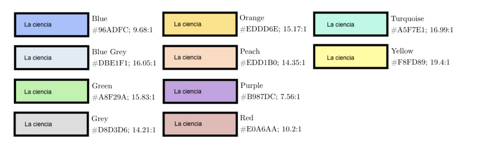

    When using a grayscale color, ensure the text color doesn't exceed 48% brightness ([source](https://uxmovement.com/content/why-your-gray-text-should-never-exceed-46-brightness/)). Ensure to provide different colors for different color schemes (e.g., Darcula theme vs light theme).

    **Bad example #1**

    

    **Bad example #2**

    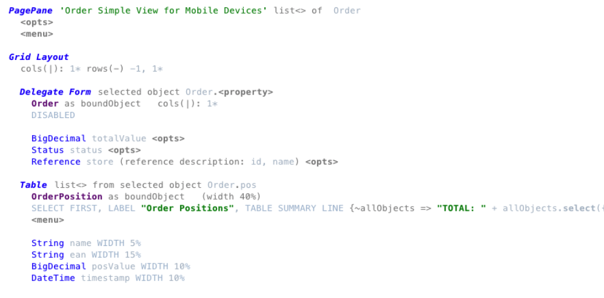

!!! hint "Bold and underline aren't used together."

    This combination is an anti-pattern. [This article](https://blog.velocitymedia.agency/bold-italics-and-underlines-how-to-use-them-effectively)
    contains some more information.
    MPS-related summary:

    - Bold
        - important phrases
        - highlighting keywords
        - Italic/Emphasis
        - Used to highlight quotes (some use blockquotes).
        - Foreign words. 
    - Underline
        - Used for links
    - CAPS
        - Used for acronyms

!!! hint "You use buttons correctly."

    (Swing) Buttons use appropriate symbols/text to make clear what they do. You can also use buttons as up and down keys. You can hide them to not to disrupt the text editing:
    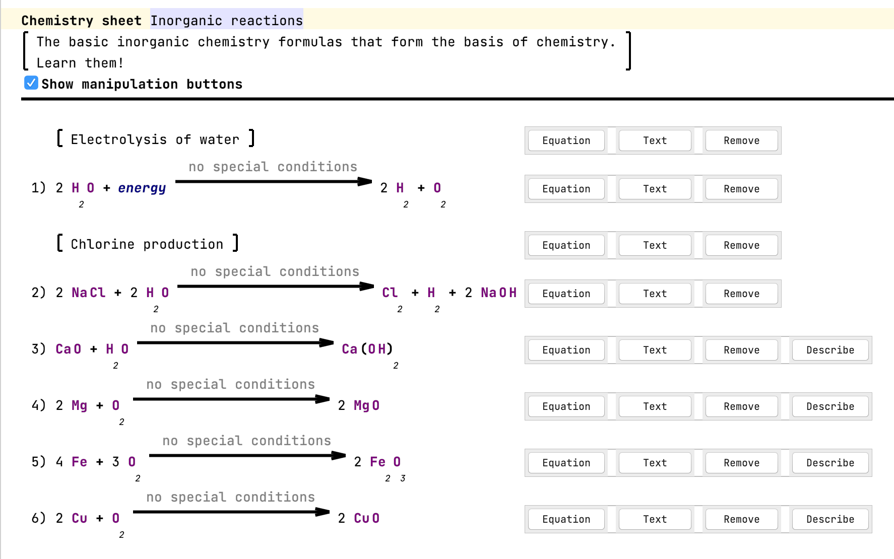
    
    Add an option to hide buttons (checkbox, editor hint, action, etc.).

!!! hint "Clickable elements appear clickable."
    
    When elements are clickable, they should appear clickable: They should use an indicator or different style (e.g., underlines and blue or styled like a button).

!!! hint "You align collections when possible."
    
    Alignment is an essential aspect of design ([introduction](https://venngage.com/design-dictionary/alignment-design-principle-definition/)). Use vertical grids instead of vertical collections to align cells nicely.
    It is also crucial for readability.

!!! hint "You use color for emphasis and to convey information."
    
    In Addition, colors can emphasize words. Make sure that the user correctly associates the used color.
    
    **Bad example**

    Greyscale editor + grey is associated with disabled content/meta information such as comments.
    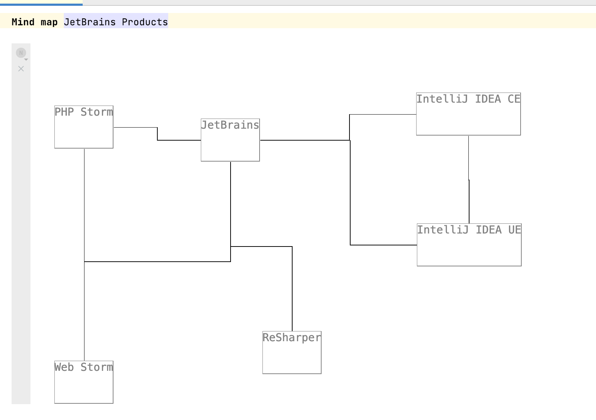

    **Good example**
    
    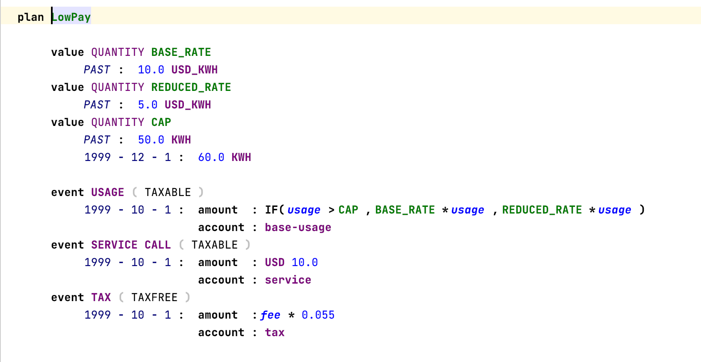
    
    Color distinguishes different language features: BLUE for numbers, lila/green for CONSTANTS.

!!! hint "You consistently use labels."
    
    Use labels consistently in the design (e.g., always bold, colon after label). The same goes for key-value pairs.
    There is no best practice for the separation between label and text. [Should label and field be separated with colon?](https://ux.stackexchange.com/questions/3611/should-label-and-field-be-separated-with-colon) contains some ideas and common guidelines.
    
    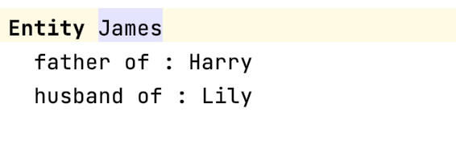

!!! hint "The context of UI elements is consistent."
    
    Counterexample: There are three buttons next to each other that look similar: One opens external documentation, the other navigates to a root node, and the third one reverts a change. This behavior could be confusing and frustrating for the user.

!!! hint "A default empty statement exists."
    
    There should always be a default concept that acts as an empty line or
    empty text. It should be editable and support auto-completion. These lines should have an indicator that they are editable. The easiest way is to provide a placeholder value.
    
    **Bad example**
    
    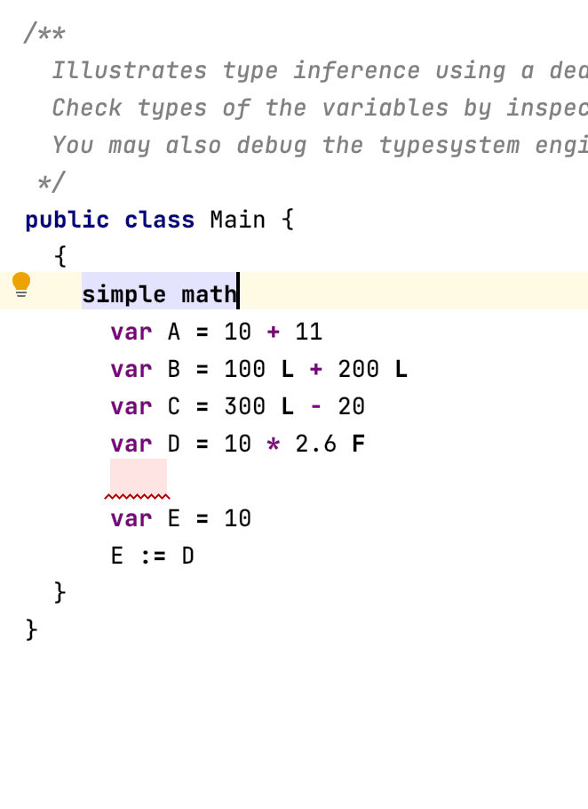{width="500px"}

!!! hint "Different groups are distinguishable from each other."

    Groups can be separated, for example, by whitespace, by drawing a border (box), or by drawing brackets around the content.

!!! hint "You emphasize non-standard operations/literals."
    
    Emphasize special operations or literals to make it clear that they are not. Other good examples in Base Language are extension methods.

    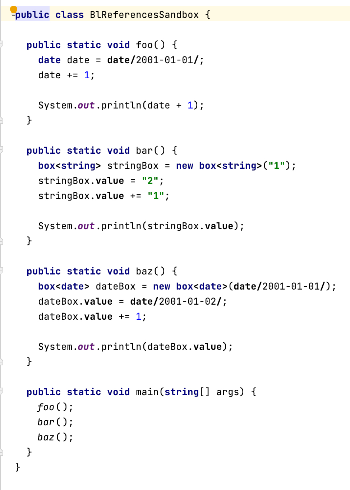

!!! hint "Enough paddings surround elements."
    
    Ensure enough space is between the content and its border (padding). Otherwise, the editor looks too packed.
    [More Padding, Please! | Patrick J. Condon](https://medium.com/wayfair-design/more-padding-please-b95e19422acc) contains more information from a design perspective.

!!! hint "You use existing stylesheets."

    For Base Language, there is [BaseLanguageStyle](http://127.0.0.1:63320/node?ref=r%3A00000000-0000-4000-0000-011c895902c3%28jetbrains.mps.baseLanguage.editor%29%2F1186415538255).
    You can search globally for instances of [Stylesheet](http://127.0.0.1:63320/node?ref=r%3A00000000-0000-4000-0000-011c8959029e%28jetbrains.mps.lang.editor.structure%29%2F1186402211651) to find more styles.

!!! hint "The font size conveys hierarchy."

    The [beginner's guide to typographic hierarchy](https://uxcel.com/blog/beginners-guide-to-typographic-hierarchy) contains more information.

    Example hierarchy (source: [Font Size And Weight Matters](https://type-ed.com/resources/rag-right/2017/11/13/font-weight-size)) : 

!!! hint "You use the entire window width for your editor."
    
    Often the space in editor components needs to be better used, and a lot of space is left empty on the right side of the window.
    You can improve this by using multiple groups next to each other or using the right-hand side of the screen for some legend for graphics or meta-information about the (root) node (e.g., code review).

!!! hint "Headers follow general UI principles."

    Follow the following principles:

    - the hierarchical relationship of ideas
    - consistency
    - readability
    - specificity

    [Technical writing essentials - Headings](https://pressbooks.bccampus.ca/technicalwriting/chapter/headings) contains some more information.

!!! hint "Headers are distinguishable from content."

    **Bad example**

    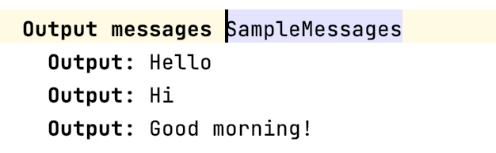

    The header and the start of the child concepts use bold font and the same text.
    In this example, the text "Output" is redundant. The header should be larger.

    A common layout is header-input-output: At the top is the header, and the output/body follows the inputs/declarations.
    Make sure to separate these three groups in some ways (such as horizontal or empty lines).

    **Mixed example**

    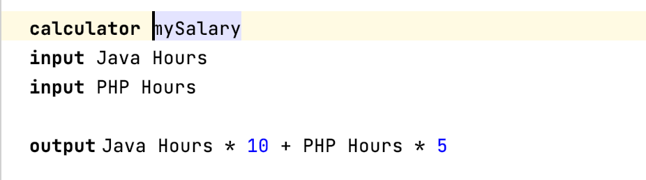

!!! hint "The lines are just a little thick and not textual."

    A good maximum width for borders and other lines is 3 pixels. This width is just a rough guideline, but thicker lines make the design overwhelming.

    **Bad example**

    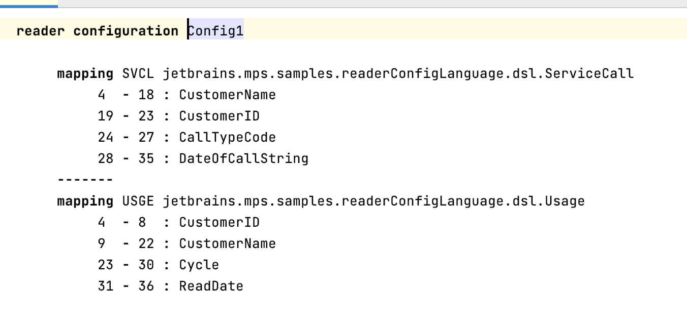

!!! hint "You don't emphasize meta/not important information."

    **Good example**

    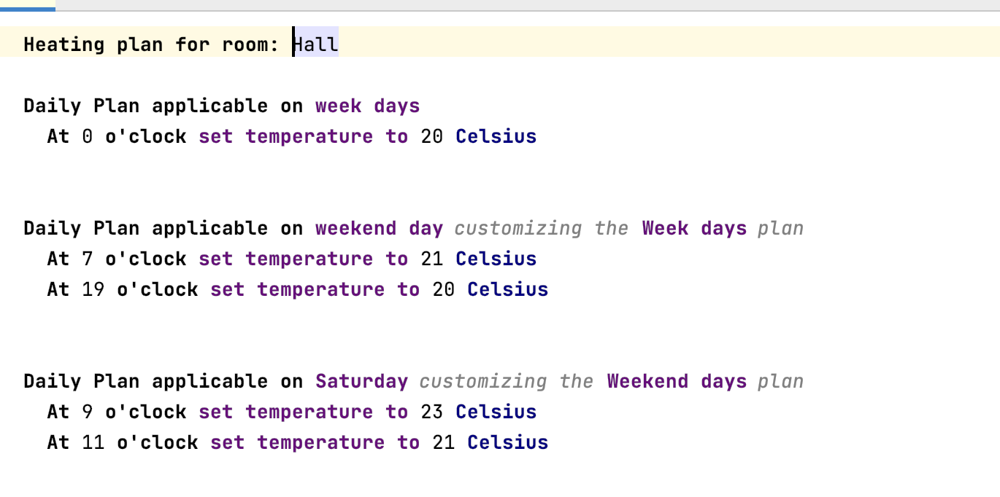

    A smaller font, light gray color, or a different font works well. Inherited values can also be shown this way: display them as placeholder values in light gray.
    Don't emphasize comments by making them bold or stand out in any way.

    **Bad example**

    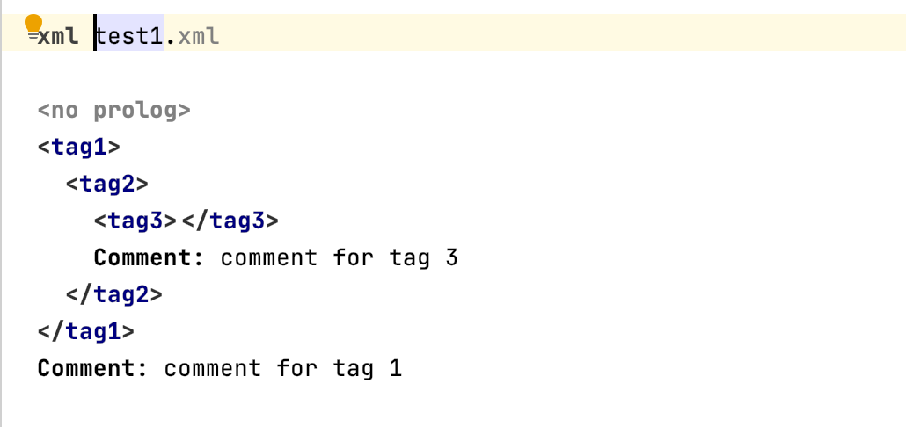

!!! hint "Don't show the reflective editor."

    The reflective editor provides a default editor for nodes. The editor is
    only read-only and should only be used for debugging purposes.

    **Bad example**

    {width="300px"}

!!! hint "You use the right form of projection for the task in the editor."

    The right projections are used (text, tables, diagrams, or others), and different projections are provided when necessary (switchable by menu or editor hints).

    **Example: multiple projections**

    

!!! hint "You didn't forget to enable anti-aliasing for custom Java Swing components."

    When you create a custom component with a paint method, call [EditorComponent.turnOnAliasingIfPossible](http://127.0.0.1:63320/node?ref=1ed103c3-3aa6-49b7-9c21-6765ee11f224%2Fjava%3Ajetbrains.mps.nodeEditor%28MPS.Editor%2F%29%2F%7EEditorComponent.turnOnAliasingIfPossible%2528java.awt.Graphics2D%2529)
    to enable anti-aliasing. The [Java documentation](https://docs.oracle.com/javase/tutorial/2d/advanced/quality.html) contains more information.

!!! hint "All usages of symbols are clear."
    
    When using symbols, make sure that the user understands what it means. 
    A Plus symbol might be easy to understand (add, increase), but a complex shape that is not usable might not. [fontawesome icon pack](https://fontawesome.com/v5.15/icons?d=gallery&p=2&m=free) contains, for example, common icons.

!!! hint "You abbreviate often-used words and symbols."

    Abbreviate words that are often used in the editor or use symbols.
    Examples:

    - The Letter "m" or a red star *\**{: style="color: red"} is often used to mark a field as mandatory.
    - The plus sign ⊕ is used to indicate an "add" action.