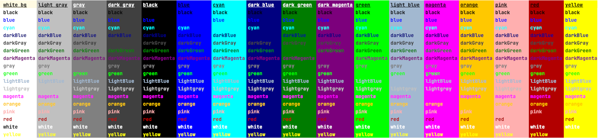
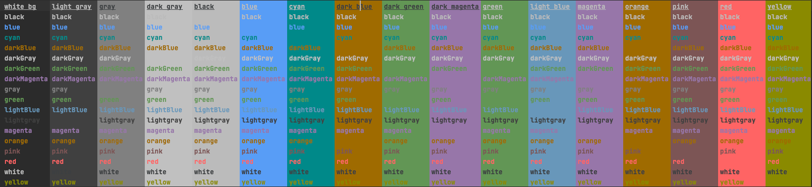

# User Experience and User Interfaces

!!! question "How can I start learning about user experience?"

    The [articles](https://www.nngroup.com/articles/) of the Nielsen Norman Group are good: [Study guides](https://www.nngroup.com/topic/study-guide/)
    with articles, and videos deal with topics such as UX basics, psychology for UX, visual design, and UX writing.

??? question ":fontawesome-solid-flask: Why do my users ignore specific tools, such as the [context action tool](https://www.jetbrains.com/help/mps/context-actions-tool.html)?"

    According to [Fitt's law](https://www.wikiwand.com/en/Fitts%27s_law), the time required to move to a target area is a function of the distance to the target divided by the width of the target. In our case, the target area is the button that opens the tool window.
    In addition, the movement with the mouse can be split into 2 phases:
    
    - initial movement: fast, imprecise
    - final movement: slow, precise

    The corners of the screen are sometimes called magic corners. At these points, two edges collide, forming a theoretically infinitely big button. As a result, they are easy to hit (e.g., Windows start button, MacOS close button).

    This explanation assumes that the MPS window takes up most of the screen's size. In MPS, the project tool is located in the upper left corner, the Git tool in the lower left corner, the inspector in the lower right corner, and the context actions tool in the upper right corner. All tools near the magic corners should be easier to hit. The initial movement should already be quite precise.

    Due to the editor's location and sometimes the screen's width (e.g., wide-screen monitors), the mouse cursor is often placed on the left side of the screen, even if the logical view is opened on the left side. Therefore the tools on the left side are easier to reach because of the smaller distance.

    For Windows users, it might also play a role that in older Windows versions, the start menu button was located in a similar position as the Git tool, which makes it easier to hit. The same can be said for the inspector, which is located near the old Windows notification area.

    If a button is not located near the magic corners, such as the terminal, it takes the users even longer to find and press the button. This additional effort makes it more unlikely that the button is pressed.

    Opening a tool also disrupts the workflow. In the editor itself, there is less jumping around involved. The mouse is often optional. Ideally, the cursor moves from one line to the next.

??? question "How do you deal with many choices in the UI?"

    The [dropdown list](https://jetbrains.github.io/ui/controls/drop_down/) page in the [IntelliJ Platform UI Guidelines](https://jetbrains.github.io/ui/)
    recommends using a dropdown when there are more than four choices. Not only the number of items can be decisive. The [context assistant](https://www.jetbrains.com/help/mps/context-assistant.html)
    handles this a bit differently, though: it switches between buttons and a dropdown depending on the total width of the choices.
    
    Therefore the number of choices is important but also the ordering of the items plays a big role: according to [Hick's law](https://www.wikiwand.com/en/Hick%27s_law), the average reaction time $T$ to make a choice is $T = b*log_2(n+1)$, where $b$ is a constant factor and $n$ the number of items. When
    the items are in order, users perform a binary search to find the item. When there is no order, the search time is linear instead.

    When there are many choices, a search functionality should be provided that works similarly to the code completion menu when a custom UI
    component is used. Similar choices can also be grouped (e.g., [intentions menu](https://jetbrains.github.io/MPS-extensions/extensions/utils/intentions-menu/) for grouping intentions).

## Basics

This section contains links to fundamental knowledge unrelated to MPS that is needed to understand the topic
user experience.

- [7 Graphic Design Principles to Up-Level Your Graphics](https://mariahalthoff.com/blog/7-graphic-design-principles)
- [7 Gestalt Principles of Design](https://ux360.design/gestalt-principles-design/)
- [10 Graphic Design Rules You Should Never Break](https://www.business2community.com/web-design/10-graphic-design-rules-never-break-01935942)
- [20 Most Important UI Design Principles for UI Designers](https://www.mockplus.com/blog/post/ui-design-principle/?r=cherry)
- [First Principles of Interaction Design](https://asktog.com/atc/principles-of-interaction-design/)
- [What are the basic rules of user interface design? (quora)](https://www.quora.com/What-are-the-basic-rules-of-user-interface-design)
- [Understanding Layout | Material Design](https://material.io/design/layout/understanding-layout.html#principles)

## Text

Currently, there are no guidelines on how to write text in MPS editors. The following links provide some information on this 
topic from non-MPS perspectives.

- [UX Writing: Handy Tips on Text Improving User Experience](https://blog.tubikstudio.com/user-experience-tips-ux-writing/)
- [The Punctuation Guide](https://www.thepunctuationguide.com/index.html)
- [Technical Writing Essentials – Document Design](https://pressbooks.bccampus.ca/technicalwriting/part/documentdesign/)
- [Word Choices and Language in UX, Part Three: User Interface Labels & Messages](https://quinnkeast.medium.com/word-choices-and-language-in-ux-part-three-user-interface-labels-messages-c1a383793e6a)

## UI

The UI in MPS is influenced by the builtin editor cells and styles, custom cells and swing components. Since there are no guidelines 
in MPS, it is important to see how other guidelines can be applied. In the end, you can have perfect guidelines, but
you might also need to adhere to your companies' guidelines. Consistency is here a very important topics, especially when
mixing different styles.

- [Design Better Forms](https://medium.com/nextux/design-better-forms-96fadca0f49c)
- [IntelliJ Platform UI Guidelines](https://jetbrains.github.io/ui/)
- [When to use checkboxes](https://docs.microsoft.com/en-us/windows/win32/uxguide/ctrl-check-boxes#is-this-the-right-control)

## UX/Usability

The following links give introductions to the topic:

- [Ten Usability Heuristics for User Interface Design](https://www.nngroup.com/articles/ten-usability-heuristics/)
- [UX Design: How to Make User Interface Readable](https://blog.tubikstudio.com/ux-design-readable-user-interface/)

The following items are cited from different UX guidelines from the web, and might be applicable to your project:

[Windows Design Techniques](https://docs.microsoft.com/en-us/windows/win32/uxguide/how-to-design-desktop-ux#design-techniques):

> - Determine the features your users need. Understand your users' needs through goal, scenario, and task analysis. Determine a set of features that realizes these objectives.

> - Remove unnecessary elements. Remove elements that aren't likely to be used or have preferable alternatives.

> - Remove unnecessary redundancy. There might be several effective ways to perform a task. To achieve simplicity, make the hard decision and choose the best one for your target users instead of providing all of them and making the choice an option.

> - Make it "just work" automatically. The element is necessary, but any user interaction to get it to work is not because an acceptable default behavior or configuration exists. To achieve simplicity, make it work automatically and either hide it from the user entirely or reduce its exposure significantly.

> - Combine what should be combined. Put the essential features that support a task together so that you can perform the task in one place. The task's steps should have a unified, streamlined flow. Break down complex tasks into easy, clear steps so that "one" place might consist of several UI surfaces, such as a wizard.

> - Separate what should be separated. Not everything can be presented in one place, so always have clear, well-chosen boundaries. Make features that support core scenarios central and obvious, and hide optional functionality or make it peripheral. Separate individual tasks and provide links to related tasks. For example, separate tasks related to manipulating photos from tasks related to managing collections of photos, but they should be readily accessible from each other.

> - Eliminate what can be eliminated. Take a printout of your design and highlight the elements used to perform the most important tasks. Even highlight the individual words in the UI text that communicate useful information. Now review what isn't highlighted and consider removing it from the design. If you remove the item, would anything bad happen? If not, remove it!
    Consistency, configurability, and generalization are often desirable qualities but can lead to unnecessary complexity. Review your design for misguided efforts in consistency (such as having redundant text), generalization (such as having several time zones when two is enough), and configurability (such as options that users aren't likely to change), and eliminate what can be eliminated.

> - Put the elements in the right place. Within a window, an element's location should follow its utility. Essential controls, instructions, and explanations should all be in context and in logical order. If more options are needed, expose them in context by clicking a chevron or similar mechanism; if more information is required, display an info-tip on mouse hover. Place less essential tasks, options, and help information in a separate window or page outside the main flow. The technique of displaying additional detail as needed is called progressive disclosure.

> - Use meaningful high-level combinations. It is often simpler and more scalable to select and manipulate groups of related elements than individual elements. Examples of high-level combinations include folders, themes, styles, and user groups. Such combinations often map to a user goal or intention that isn't apparent from the individual elements. For example, the purpose behind the high-contrast black color scheme is far more apparent than that of a black window background.

> - Select the proper controls. Design elements are embodied by the controls you use to represent them, so selecting the right control is crucial to efficient presentation. For example, the font selection box used by Microsoft Word shows both a preview of the font and the most recently used fonts. Similarly, the way Word shows potential spelling and grammar errors in place is much simpler than the dialog box alternative.

> - Make tasks discoverable and visible. All tasks, especially frequent ones, should be readily discoverable within the user interface. The steps required to perform tasks should be visible and not rely on memorization.

> - Present tasks in the user's domain. Complex software requires users to map their problems to the technology. Simple software does that mapping for them by presenting what is natural. For example, a red-eye reduction feature maps directly to the problem space and doesn't require users to think about details like hues and gradients.

> - Put domain knowledge into the program. Users shouldn't be required to access external information to use your application successfully. Domain knowledge can range from complex data and algorithms to simply clarifying what type of input is valid.

> - Use text that users understand. Well-crafted text is crucial to effective communication with users. Use concepts and terms familiar to your users. Thoroughly explain what is being asked in plain language so that users can make intelligent, informed decisions.

> - Use safe, secure, probable defaults. If a setting has a value that applies to most users in most circumstances and that setting is both safe and secure use it as the default value. Make users specify values only when necessary.

> - Use constraints. If many ways to perform a task exist, but only some are correct, constrain the task to those correct ways. Users should not be allowed to make readily preventable mistakes.

[Window UX Top Violations](https://docs.microsoft.com/en-us/windows/win32/uxguide/top-violations):

> - Use ordinary, conversational terms when you can. Focus on the user goals, not technology. This technique is especially effective if you are explaining a complex technical concept or action. Imagine looking over the user's shoulder and explaining how to do the task. IN CONFLICT WITH Domain

> - Be polite, supportive, and encouraging. The user should never feel condescended to, blamed, or intimidated.

> - Remove redundant text. Look for redundant text in window titles, main instructions, supplemental instructions, content areas, command links, and commit buttons. Generally, leave the entire text in the main instructions and interactive controls, and remove any redundancy from the other places.

> - Use title-style capitalization for titles and sentence-style capitalization for all other UI elements.

> - For feature and technology names, be conservative in capitalizing. Typically, only major components should be capitalized (using title-style capitalization).

> - For feature and technology names, be consistent in capitalizing. If the name appears more than once on a UI screen, it should always appear the same way. Likewise, you should consistently present names across all UI screens in the program.

> - Don't capitalize the names of generic user interface elements, such as toolbars, menus, scroll bars, buttons, and icons. Exceptions: Address bar, Links bar, ribbon.

> - Don't use blue text that isn't a link because users may assume it is a link. Use bold or a shade of gray where you'd otherwise use colored text.

> - Use bold sparingly to draw attention to text users must read.

> - Don't place periods at the end of control labels or main instructions.

> - Use one space between sentences, not two.

> - Label every control or group of control.

> - Select the safest (to prevent data loss or system access) and most secure value by default for all controls.

> - Use notifications for events that are unrelated to the current user activity, don't require immediate user action, and users can freely ignore.

> - on't abuse notifications: Use notifications only if you need to. When you display a notification, you can interrupt or even annoy users. Make sure that interruption is justified. Use notifications for non-critical events or situations that don't require immediate user action. Use an alternative UI element (such as a modal dialog box) for critical events or situations requiring immediate user action. Don't use notifications for feature advertisements!

> - Never require users to click an object to determine if it is clickable. Users must be able to determine clickability by visual inspection alone.

> - Whenever possible, propose a solution so users can fix the problem. However, make sure the proposed solution is likely to solve the problem. Refrain from wasting users' time by suggesting possible but improbable solutions.

> - Be specific. Avoid vague wording, such as syntax errors and illegal operations. Provide specific names, locations, and values of the objects involved.

> - Don't use phrasing that blames the user or implies user error. Avoid using *you* and *your* in the phrasing. While the active voice is generally preferred, use the passive voice when the user is the subject and might feel blamed for the error if the active voice were used.

> - Don't use *OK* for error messages. Users don't view errors as being OK. If the error message has no direct action, use *Close* instead.

> - Don't use the following words:
>     - Error, failure (use problem instead)
>     - Failed to (use unable to instead)
>     - Illegal, invalid, bad (use incorrect or not valid instead)
>     - Abort, kill, terminate (use stop instead)
>     - Catastrophic, fatal (use serious instead)

## Dark Theme

Use the predefined colors in MPS or define your colors using the class [JBColor](http://127.0.0.1:63320/node?ref=498d89d2-c2e9-11e2-ad49-6cf049e62fe5%2Fjava%3Acom.intellij.ui%28MPS.IDEA%2F%29%2F%7EJBColor) with the constructor `JBColor(light theme color, dark theme color)`. By using this class, verifying if the user is using the Darcula theme shouldn't be necessary. The MPS colors already support the light and dark theme because they inherit from `JBColor`. As seen in the screenshot below, the colors can be different when using the dark theme (e.g., the white and black colors). Don't use hard-coded hex colors or the class [Color](http://127.0.0.1:63320/node?ref=6354ebe7-c22a-4a0f-ac54-50b52ab9b065%2Fjava%3Ajava.awt%28JDK%2F%29%2F%7EColor).

<figure markdown>
  
  <figcaption>Light theme</figcaption>
</figure>

<figure markdown>
  
  <figcaption>Dark theme</figcaption>
</figure>

Ensure the foreground color is readable for the chosen background (see preceding screenshots). You can use an online [contrast checker tool](https://webaim.org/resources/contrastchecker/) to verify that the color combination is readable.

Example for colors with a good contrast ratio (foreground: black; you can find the ratio after the hex code):


If this change isn't feasible, you can switch to the default theme (useful for RCPs):

```java
class LookAndFeel {
    void set() {
        LafManager lafManager = LafManager.getInstance();
        QuickChangeLookAndFeel.switchLafAndUpdateUI(lafManager, LafManagerImpl.getTestInstance().getDefaultLightLaf(), false);
    }
}
```

Additional useful resources:

- [ColorUtil](http://127.0.0.1:63320/node?ref=498d89d2-c2e9-11e2-ad49-6cf049e62fe5%2Fjava%3Acom.intellij.ui%28MPS.IDEA%2F%29%2F%7EColorUtil) (fromHex, darker, brighter, withAlpha, saturate, desaturate...)

- MPS color definitions: [MPSColors.java](https://github.com/JetBrains/MPS/blob/master/editor/editor-runtime/source/jetbrains/mps/nodeEditor/MPSColors.java)

- JBColor.[brighter](http://127.0.0.1:63320/node?ref=498d89d2-c2e9-11e2-ad49-6cf049e62fe5%2Fjava%3Acom.intellij.ui%28MPS.IDEA%2F%29%2F%7EJBColor.brighter%2528%2529)() + JBColor.[darker](http://127.0.0.1:63320/node?ref=498d89d2-c2e9-11e2-ad49-6cf049e62fe5%2Fjava%3Acom.intellij.ui%28MPS.IDEA%2F%29%2F%7EJBColor.darker%2528%2529)() e.g. `new JBColor(JBColor.PINK, JBColor.PINK.darker().darker())`

- IntelliJ IDEA color definitions: [JBColor](https://github.com/JetBrains/intellij-community/blob/master/platform/util/ui/src/com/intellij/ui/JBColor.java#L354)

- IntelliJ IDEA platform colors + explanation: [JBUI](https://github.com/JetBrains/intellij-community/blob/master/platform/util/ui/src/com/intellij/util/ui/JBUI.java) + [Platform theme colors](https://jetbrains.github.io/ui/principles/platform_theme_colors/)

- [Apple color Guidelines](https://developer.apple.com/design/human-interface-guidelines/foundations/color/)