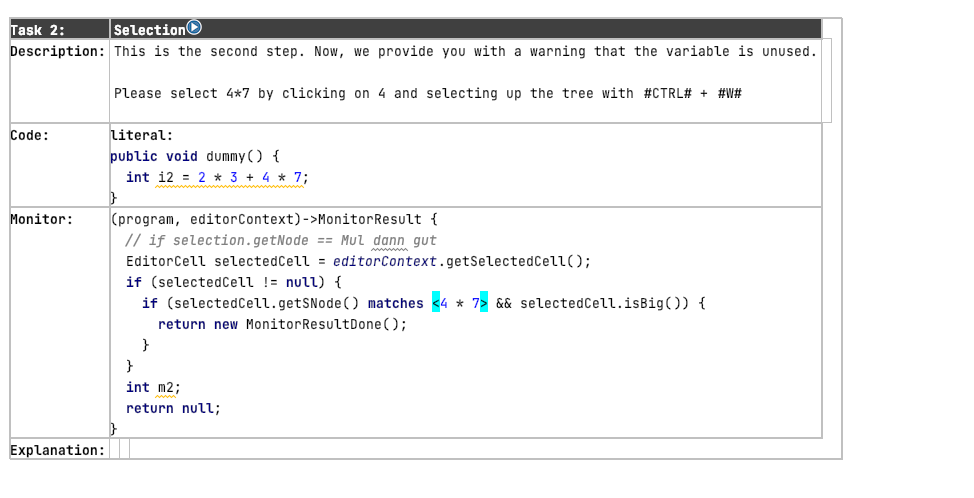
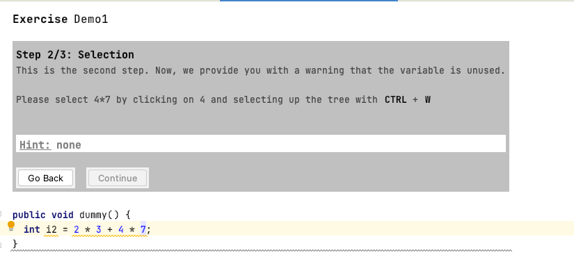
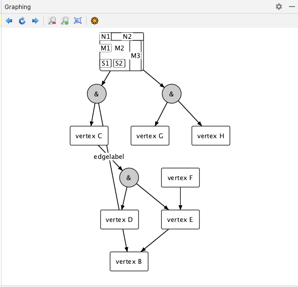
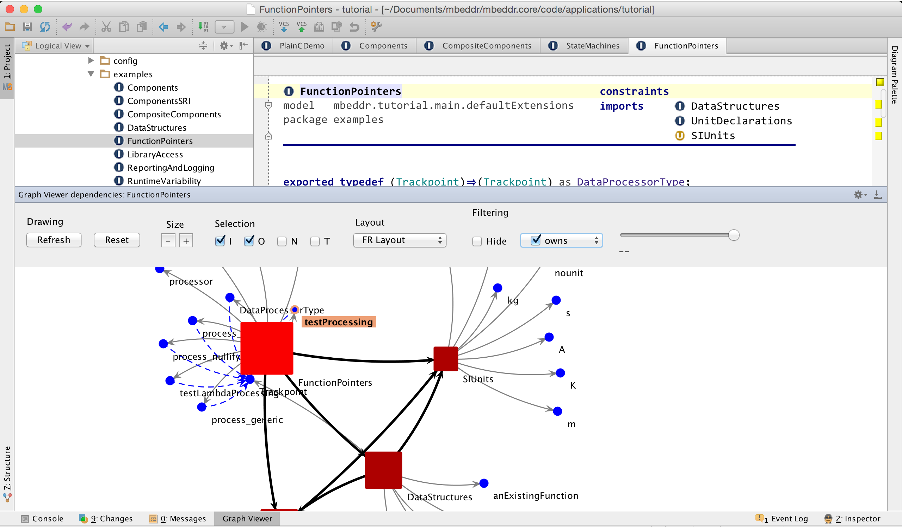

---
tags:
- reference
---

# Tools

This page explains some custom [tools](https://www.jetbrains.com/help/mps/plugin.html#tools) of the {{ mbeddr_platform() }}.
Some of the tools are slightly experimental, so use them with care.

## Context Actions

> ^^com.mbeddr.mpsutil.contextactions^^

This language adds a tool with context-specific editor actions that you can navigate with the mouse. For more information about the
JetBrains implementation, visit the page [Context actions tool | MPS](https://www.jetbrains.com/help/mps/context-actions-tool.html).
Two different tools exist, named *Context Actions* and *Context Actions 2* (mbeddr). The main difference between mbeddr and MPS context actions is that in mbeddr, it's possible to define actions in a plugin solution whereas with the MPS language you can only define actions in the editor aspect of a language. 

## Editing Guide

> ^^com.mbeddr.mpsutil.editingGuide^^

This language can create interactive exercises for end users that you can automatically. An exercise contains several tasks and includes a reference to the following exercise. A single task has a name, a description, and a code block that should be
shown in the exercise. The monitor function checks the completion status of the task. The variable `program` refers to the code section. The `editorContext` can be used, for example, to get the selected cell by calling `editorContext.getSelectedCell()`. You can return the following objects:

- **MonitorResultDone**: You completed the task successfully, and you see the explanation.
- **MonitorResultError**: You completed the task with an error.
- **MonitorResultHint**: You didn't complete the task successfully and see a hint.

You can start the task by clicking the play button next to the name of a task. The language creates a new
temporary model, which contains the editable task.

## Favourites Plugin

> ^^com.mbeddr.mpsutil.favourites.plugin^^

The favorites view uses the language ^^com.mbeddr.mpsutil.projectview^^ from [MPS-extensions](https://jetbrains.github.io/MPS-extensions/extensions/other/project-view/).

There's an action `Add to Favourites` to add a node to this view. You can remove the node by executing the action
`Remove from Favourites`. Internally, the plugin attaches the information using node annotations.

## Generated Artifacts Review

> ^^com.mbeddr.mpsutil.genreview^^

!!! warning "This language might not work correctly anymore."

View artifacts that were generated by a generator with this tool. It has a special color mapping for Java files.
The button `Highlight lines not linked` should highlight the lines which aren't related to any node. When you can trace multiple
original nodes to a certain file and line, navigate these nodes with the previous and next buttons.

## Graphstream

> ^^com.mbeddr.mpsutil.graphstream^^

This language adds support for [GraphStream](https://graphstream-project.org/), a dynamic Java graph library. It can show a graph inside a *Graphing* tool. Look at the language
^^com.mbeddr.mpsutil.graphstream.example^^ to see how you can load a graph. A concept has to
implement the interface [GraphingElement](http://127.0.0.1:63320/node?ref=r%3Ae5f563f0-3312-4f0d-a6fe-8d43c8a221d4%28com.mbeddr.mpsutil.graphstream.structure%29%2F5447190170711933193). When the currently selected node implements the interface,
a new menu *View Graph* appears in the editor context menu.

The tool supports a history, zooming, fitting the view, and rendering the graph as
a [GraphViz](https://graphviz.org/) SVG.

## JUNG Framework

> ^^com.mbeddr.mpsutil.jung^^

As an additional means of displaying relationships between nodes (next to PlantUML and the tree views),
the [JUNG](http://jung.sourceforge.net/) framework was integrated for displaying graphs.
As a language developer, you can implement an interface IJGraphProvider and implement a method that creates the graph:

- programmable with high-level API
- specify the initial layout
- configurable node size, color, line style, and color, fill color, shape, and label
- configurable edge width, style, color, and label
- configurable tooltip text for nodes and edges
- extensibility to plug in your layout engines (such as the one from yWorks)

Once you have created a graph, your users have many options for viewing the graph in an MPS tool window:

- double-click selects node or edge in the editor
- zoom and pan
- tooltips
- selectable layouts
- selection and highlighting of outgoing and incoming nodes and edges
- filtering based on node and edge type
- filtering along a continuous axis (for example, time)
- incremental, node-based collapsing and expansion

The JUNG integration is available as part of mbeddr and the mbeddr\.platform, so that you can use it for your languages. Check out the Chunk node for an example of how to use it.

This old [YouTube video](http://youtu.be/-v1X0GhsLJ4) showcases this language.

To use it in your language, implement the [IJGraphProvider](http://127.0.0.1:63320/node?ref=d09a16fb-1d68-4a92-a5a4-20b4b2f86a62%2Fr%3A6e32694b-6dd1-4530-b48f-4e3bf97b2744%28com.mbeddr.mpsutil.jung%2Fcom.mbeddr.mpsutil.jung.structure%29%2F6388491840914066147) interface. Return a JNGraph from the getGraph() method. Check out the existing implementations, particularly the DepGraphHelper (called from Chunk.getGraph()), to learn the details. In short, a graph is built in two steps: the first step adds the nodes and edges. The second step uses closures to style the graph.

## PlantUML

> ^^com.mbeddr.mpsutil.plantuml.node^^

This language provides an integration of [PlantUML](https://plantuml.com/) with MPS. Watch [this old video](https://www.youtube.com/watch?v=QjwXITp6fwg) to get an overview.

To use it in your languages, implement the [IVisualizable](http://127.0.0.1:63320/node?ref=b4d28e19-7d2d-47e9-943e-3a41f97a0e52%2Fr%3A4903509f-5416-46ff-9a8b-44b5a178b568%28com.mbeddr.mpsutil.plantuml.node%2Fcom.mbeddr.mpsutil.plantuml.node.structure%29%2F3225038607917463880) interface in your language concept. Each concept can have several visualizations called categories. The `getCategories()` method returns the list (just strings). The `getVisualization()` method then returns the actual visualization. It gets the user-requested category as an argument and an empty VisGraph object. The `getVisualization()` method then fills the VisGraph with the actual visualization using the `add()` method to build a native, textual PlantUML visualization. Check out the existing interface implementations to learn the details; in particular, There's a helper method on VisGraph that creates a URL for users to click in the graph: `createUrl(node)`.

## Tool Runner

> ^^com.mbeddr.mpsutil.toolrunner.plugin^^

This solution provides an extension point ToolsSanityCheckerProvider that allows registering instances of [ToolsAvailabilityChecker](http://127.0.0.1:63320/node?ref=r%3Aeb55a79e-712e-453c-8ff8-d50d0340bc94%28com.mbeddr.mpsutil.toolrunner%29%2F8869103559931921994).
This interface checks the availability of external tools and their proper configuration. You can call it through `ToolsInstallationSanityChecker.check`. There's also a class called [ToolRunnerBase](http://127.0.0.1:63320/node?ref=r%3Aeb55a79e-712e-453c-8ff8-d50d0340bc94%28com.mbeddr.mpsutil.toolrunner%29%2F4775168500935975079), a base class for running external tools. It supports running the tool with a progress indicator, a customizable timeout, and reading the (error) output.

## Trace Explorer

> ^^com.mbeddr.mpsutil.traceExplorer^^

This language contributes a new tool *Trace Explorer*, that can show and navigate traces of a model.

[KernelF paper](https://voelter.de/data/pub/kernelf-reference.pdf#page=14) contains an example. The [interpreter page](interpreter.md#tracing-in-kernelf)
explains the IETS3 tracing.