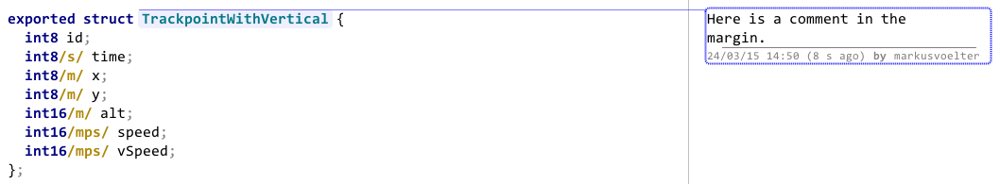
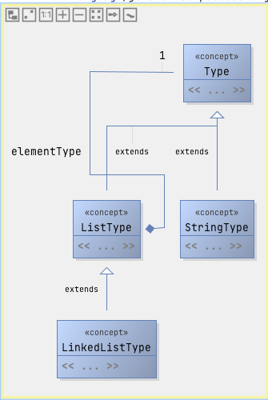
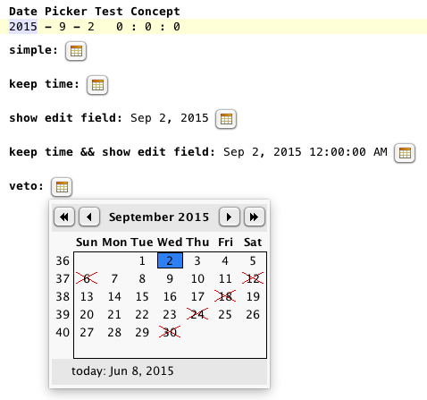
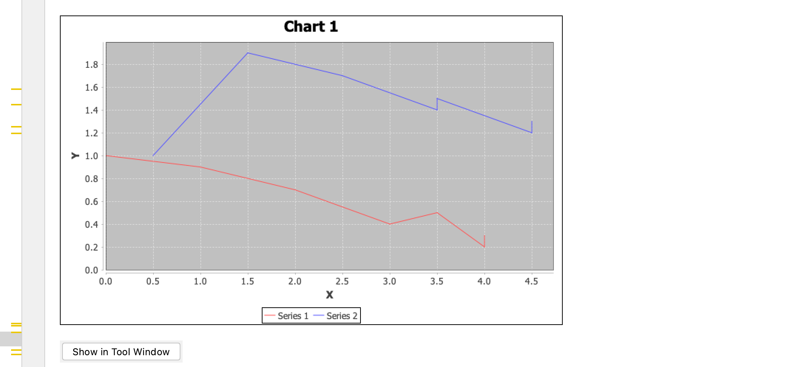
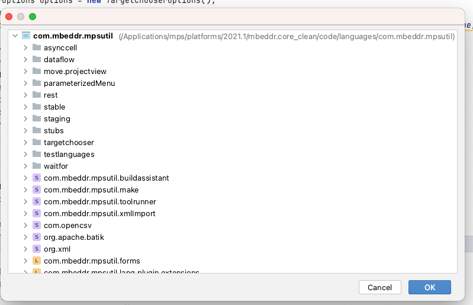

# UI

This page contains the description of languages that add new cells to the editor. For more editor-related extensions,
visit [Editor Extensions | MPS Extensions](https://jetbrains.github.io/MPS-extensions/extensions/editor/celllayout/).

### AsyncCell

The async cell allows displaying a text-based loading indicator as long as the return string is null.

Create a new `$custom cell$` editor cell and return a new AsyncCellProvider:

```java
return new AsyncCellProvider(node, { =>
    string value = calculateValue(); // calculate or query your value here
    if (value.isEmpty) { return null; }
    Style style = editorContext.?getContextCell().?getStyle();
    return new AsyncCellValue(value, style);
});
```


### FrameCell

> ^^com.mbeddr.mpsutil.framecell^^

The [frame](http://127.0.0.1:63320/node?ref=b33d119e-196d-4497-977c-5c167b21fe33%2Fr%3A724443d4-b85d-4829-9ddf-5c5d9b1583dc%28com.mbeddr.mpsutil.framecell%2Fcom.mbeddr.mpsutil.framecell.structure%29%2F8760592470373336790) cell is a special editor cell collection that draws a top and bottom border around its contained cell. It supports the following style attributes:

- **frame-color**: the color of the frame (default: black)
- **frame-width**: the thickness of the frame (default: 1 pixel)
- **frame-padding**: the space between the containing cell and the frame (default: 3 pixels)

An example can be seen in the documentation language:


In most cases, you can use the language ^^de.itemis.mps.editor.celllayout^^ from {{ mps_extensions() }} to customize the border and margins around a cell.  The [MPS Extensions documentation](https://jetbrains.github.io/MPS-extensions/extensions/editor/celllayout/) contains more information.

### Margin Cell/Review

> ^^com.mbeddr.mpsutil.margincell^^ and ^^com.mbeddr.mpsutil.review^^

Margin cells are editor cells shown beyond the right editor margin, a bit like comments in Word.
The ReviewNote cell implements exactly Word's comment facility as an example of the margin cell. Here is a screenshot:



Just include the respective language ^^com.mbeddr.mpsutil.review^^  to use the review notes. Intentions are available to attach review notes to editor cells.

Your cell must implement the IMarginCellContent interface to put your cells into the right margin. The editor of your cell may use the *margincell-cell-width* and *margincell-dashed-line-interval* style attributes to design the width and line style. The actual margin cell must be on the root element of the editor. However, as illustrated by the CommentAnnotationContainer from the review language, you can use an annotation to achieve this. Hence, you can add margin comments to every model without the model's language being aware.

### Placeholder Text List

> ^^com.mbeddr.mpsutil.placeholderTextList^^

This language adds a new [cell model](http://127.0.0.1:63320/node?ref=r%3Ae633d72e-7309-4abb-b48b-c0511f07461b%28com.mbeddr.mpsutil.placeholderTextList.structure%29%2F1739942158294184652) that supports multiple aggregations with a custom placeholder text.

Specify the placeholder in the inspector by creating a query function for the *placeholder text*.

### Diagrams

#### Concept Diagram

> ^^com.mbeddr.mpsutil.conceptdiagram^^



Create a new root node of the type [ConceptDiagram](http://127.0.0.1:63320/node?ref=r%3A40ee9130-2844-4f59-96e6-d12b358ca46c%28com.mbeddr.mpsutil.conceptdiagram.structure%29%2F2634829965774842138). The editor should now contain an empty editor. You can drag nodes
from the *Diagram Palette* to the diagram. If nodes from other languages are needed, add the language to the *languages*
section.

#### Dependencies Diagram

> ^^com.mbeddr.mpsutil.dependenciesdiagram^^

This language contains a concept [DependenciesDiagram](http://127.0.0.1:63320/node?ref=r%3Aa1fbbb29-6fd2-49ce-b0b8-414a40e14ddc%28com.mbeddr.mpsutil.dependenciesdiagram.structure%29%2F7129450248256615870)

Drag a model or module reference from the diagram palette to the diagram. Dependencies to other models/modules are automatically added. The line between the two boxes visualizes the dependencies, and its label has a name after the scope of the dependency (e.g., the label is *uses* if you have imported the language).


## Date Picker

> ^^com.mbeddr.mpsutil.datepicker^^

A classic widget to select a date from a pop-up calendar.



!!! warning "There's a [known issue](https://github.com/mbeddr/mbeddr.core/issues/2203) on macOS. The date picker doesn't work when the theme is set to macOS light."

This widget is only the control. The developer handles synchronizing the control with the source of the shown date. We provide hooks executed before showing the calendar to determine whether a date is valid and process a selected date.

## Editor Utils

> ^^com.mbeddr.mpsutil.editor.utils^^

The class [EditorRuntimeUtil](http://127.0.0.1:63320/node?ref=371850a9-2c5b-4e1d-a811-70d97e847917%2Fr%3Af4ae6487-fb1d-418f-8dd3-759f9604156f%28com.mbeddr.mpsutil.editor.utils%2Fcom.mbeddr.mpsutil.editor.utils.runtime%29%2F4912572611769853192) contains a few helpful editor utility methods:

- **getErrorText(EditorContext)**: returns the error text of the selected cell in the editor
- **collectAllOpenEditors(Project)**: returns all opened MPS editors
- **collectAllOpenEditorComponents(Project)**: returns all opened editor components

## File Picker

> ^^com.mbeddr.mpsutil.filepicker^^

This language contains text-based files and folder pickers. Enter paths directly in
the editor. There's also an intention `Open File Chooser Dialog` that shows a file chooser dialog. The following file selectors are supported:

- [file system dir picker](http://127.0.0.1:63320/node?ref=r%3A2a10821d-612f-4a73-b7b0-ed6b57106321%28com.mbeddr.mpsutil.filepicker.structure%29%2F4881264737620519319)
- [file system file picker](http://127.0.0.1:63320/node?ref=r%3A2a10821d-612f-4a73-b7b0-ed6b57106321%28com.mbeddr.mpsutil.filepicker.structure%29%2F1504214765033455826)
- [macro file picker](http://127.0.0.1:63320/node?ref=r%3A2a10821d-612f-4a73-b7b0-ed6b57106321%28com.mbeddr.mpsutil.filepicker.structure%29%2F8297282968580444334)
- [macro folder picker](http://127.0.0.1:63320/node?ref=r%3A2a10821d-612f-4a73-b7b0-ed6b57106321%28com.mbeddr.mpsutil.filepicker.structure%29%2F4881264737614560289)
- [solution relative dir picker](http://127.0.0.1:63320/node?ref=r%3A2a10821d-612f-4a73-b7b0-ed6b57106321%28com.mbeddr.mpsutil.filepicker.structure%29%2F2642765975824060179)
- [solution relative file picker](http://127.0.0.1:63320/node?ref=r%3A2a10821d-612f-4a73-b7b0-ed6b57106321%28com.mbeddr.mpsutil.filepicker.structure%29%2F6156524541423588207)

The macro pickers can contain [path variables](https://www.jetbrains.com/help/mps/absolute-path-variables.html).

## Hyperlink

> ^^com.mbeddr.mpsutil.hyperlink^^

Use hyperlink cells for references in MPS. In contrast to normal reference cells, they automatically become blue and underlined if the mouse hovers over them (no Ctrl is necessary). The following style attributes are supported:

- **hyperlink-reference**: Create a link for a node reference.
- **hyperlink-handler** is a function that's called when you click a link. The *util* parameter object contains a method
  *openInBrowser* for opening a URL with the default web browser.
- **hyperlink-style**: can be an URL or reference. The reference style forces the usage of the key *ctrl* to activate the hyperlink.
- **hyperlink-node** is the node that should be displayed after clicking the link
- **hyperlink-focus** sets the focus on the target node of the hyperlink after navigating to it.
- **hyperlink-select** selects the target node of the hyperlink after navigating to it.

## JFreeChart

> ^^com.mbeddr.mpsutil.jfreechart^^

This module contains stubs for the [JFreeChart](https://www.jfree.org/jfreechart/) library. View the charts in
the *Chart* tool by calling the following code:

```java
ChartManager.getInstance(editorContext).setChart(node.createChart())
```

createChart` returns an instance of [JFreeChart](http://127.0.0.1:63320/node?ref=7fe13e34-8620-4d5d-92c7-df091b0ed628%2Fjava%3Aorg.jfree.chart%28com.mbeddr.mpsutil.jfreechart.runtime%2F%29%2F%7EJFreeChart).



## Target chooser

> ^^com.mbeddr.mpsutil.targetchooser^^

The target chooser language provides a modal dialog for choosing nodes based on a predefined scope:



Example code:

```java
TargetChooserOptions options = new TargetChooserOptions(); 
project.getModelAccess().runReadAction({ => 
  options.setScope(new arraylist<node<>>{node/TargetChooser/, node/TargetChooserDialog/, node/DefaultModuleScope/}); 
}); 
TargetChooser chooser = new TargetChooser(ProjectHelper.toIdeaProject(project), options);
TargetChooserDialog.chooseTarget(#project, options)
```

The *options* object has the following setters:

- **setInitial** sets the initially selected item. This object can be a node or a model.
- **setSelectionValidator**: A selection validator checks if the selected target is valid or shows an error message when it's invalid. By default, no validation occurs (the languages uses an empty validator).
- **setSNodeFilter**: This filter decides which nodes should be visible in the dialog (within the selected scope).
  To show a node, you must return true for the root node but not all ancestors.
- **setModuleScope**: This scope defines the available modules that will be the sources for the nodes that will be displayed.
- **addModuleFilter** adds a boolean filter for the modules of the module scope.
- **showModulesPool** sets a flag that decides if the modules pool (last entry in logical view) should also be visible in the dialog.
- **setModelFilter** sets a filter only to keep the models of the specified scope where the filter returns true
- **setScope** sets the scope for the items that should be visible in the dialog. This object can be an instance of
  [TargetChooserScope](http://127.0.0.1:63320/node?ref=r%3A24b43531-125c-4436-b4b0-f3444d2173fd%28com.mbeddr.mpsutil.targetchooser%29%2F7547442689028637169) or a sequence of nodes (+ ancestor filter). By default, the specified modules scope
  with the specified model and node filers applied is used.

## User Styles

> ^^com.mbeddr.mpsutil.userstyles^^

This language provides a new annotation *@userConfigurable* that can be added to a style class in a style sheet
(intention: *Make User Configurable*). After defining a name, the user can change the style in the preferences
(*Preferences*-->*Editor*-->*Color Scheme*-->*Code*). The following style-class items are supported:

- **Foreground**: equivalent to *text-foreground-color*
- **Background**: equivalent to *text-background-color*
- **Bold**: equivalent to *font-style: bold*
- **Italic**: equivalent to *font-style: italic*
- **Effects: Dotted lines, bold underscored, underscored, underwaved**: equivalent to *underlined*
- **Effects: strikeout**: equivalent to *strike-out*

Further useful links for developers:

- [Export IntelliJ editor themes as plugin | JetBrains blog](https://blog.jetbrains.com/platform/2017/12/export-intellij-editor-themes-as-plugins/)
- [UI Themes — Editor Schemes and Background Images | IntelliJ Platform Plugin SDK](https://plugins.jetbrains.com/docs/intellij/themes-extras.html)
